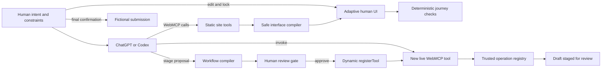

# CivicWeave — Complete Build Specification

**Working product name:** CivicWeave  
**Tagline:** The portal that compiles itself around your goal.  
**Project type:** WebMCP Challenge submission  
**Primary concept:** Adaptive Interface Compiler + WebMCP Toolsmith  
**Target implementation:** A polished, fully client-side React application that can be built and deployed from this specification without additional product decisions.

---

## 0. Execution Contract for the Coding Agent

You are the implementation agent. Read this entire specification before editing files.

Build the complete project, not a scaffold or prototype shell. Do not ask the user product questions. Where a minor implementation detail is unspecified, choose the simplest robust option consistent with this specification. Implement P0 requirements before polish, but do not stop until all acceptance criteria and required checks pass.

During implementation:

1. Create and maintain `STATUS.md` with completed work, current failures, and remaining tasks.
2. Use strict TypeScript. Do not use `any` except in a narrowly isolated browser-API compatibility boundary.
3. Run and fix all required commands: lint, typecheck, unit tests, integration tests, end-to-end tests, and production build.
4. Inspect the application through Playwright screenshots at desktop and mobile widths. Fix obvious layout, overflow, contrast, focus, and interaction problems.
5. Do not stop after creating files. Finish the end-to-end canonical journey.
6. Do not add an OpenAI API call, backend LLM, authentication service, database, wallet, payment provider, or external government integration.
7. Do not allow the agent to generate or execute JavaScript, HTML, CSS, React code, selectors, URLs, or arbitrary network requests.
8. Preserve the human approval boundaries defined in this document.
9. If native WebMCP is unavailable in the local browser, use the specified in-memory adapter and Playwright mock. Keep the real top-level `document.modelContext.registerTool(...)` integration in production code.
10. Treat this file as the source of truth. Record unavoidable deviations in `STATUS.md` and choose the safer, smaller behavior.

The build is complete only when every P0 acceptance criterion in Section 26 passes.

---

## 1. Product Summary

CivicWeave is a fictional city-services portal that demonstrates a new pattern for the web:

1. A person tells an agent what they need and how they want to interact.
2. The website exposes a structured capability graph through WebMCP.
3. The agent calls WebMCP tools to compile a task-specific, accessible interface from safe website-owned components.
4. The person edits or locks parts of that interface.
5. The website deterministically verifies the journey.
6. The agent proposes turning the approved interface and workflow into a reusable WebMCP tool.
7. A human explicitly approves registration.
8. The website dynamically registers the new tool in the live page.
9. The agent discovers and invokes that newly created tool.
10. The workflow stages a real-looking application for review but cannot submit it. Only the human can perform final submission.

The defining demo moment is not merely that an agent uses website tools. It is that the **website’s available tool surface changes live after human approval**, and the newly registered tool is immediately usable by the agent in the same page session.

---

## 2. Problem Being Solved

Complex portals are designed around organizational structures, menus, departments, forms, and edge cases. Users think in goals:

- “Renew my parking permit.”
- “Use large controls.”
- “Explain things plainly.”
- “Use the information already on file.”
- “Never submit without asking me.”

Today, users must translate their goal into the portal’s structure. Browser agents can click through the same structure, but they still inherit its ambiguity and brittleness.

CivicWeave changes the division of labor:

- **The person supplies intent, preferences, corrections, and approval.**
- **The agent interprets intent and composes a workflow.**
- **The website supplies trusted capabilities, schemas, validation, rendering, live state, and execution.**

The result is a temporary interface for the current goal and, after explicit approval, a reusable agent capability for future runs.

---

## 3. Winning Thesis

Use this exact conceptual framing throughout the README, demo, and submission:

> Most WebMCP sites give agents a fixed set of tools. CivicWeave lets a person and an agent safely compile a new interface and a new reusable WebMCP tool from the website’s trusted capabilities—then registers that tool live, without generating or executing code.

Supporting line:

> One trusted application, many interfaces, and a tool surface that can grow with the user.

Do not describe the product as generic AI form filling. Do not describe it as a chatbot. Do not claim that it adapts arbitrary third-party websites. It is a proof of a general architecture implemented deeply in one realistic fictional portal.

---

## 4. Scope and Non-Goals

### 4.1 P0 scope

Build one polished fictional municipal portal named **Northstar City Services** with:

- One canonical fully featured service: **Parking Permit Renewal**.
- One secondary service proving reuse of the architecture: **Address Change**.
- A dense conventional portal interface.
- An adaptive task interface compiled through WebMCP.
- Human-editable and lockable generated views.
- Deterministic journey and accessibility checks.
- A safe workflow compiler.
- Human-approved dynamic WebMCP tool registration.
- A live tool-surface inspector and activity ledger.
- A final human-only confirmation action.
- Native WebMCP support plus an in-memory simulator for ordinary browsers and automated tests.

### 4.2 Explicitly out of scope

Do not implement:

- Real municipal or government integration.
- Real identity, login, payment, email, file upload, or data submission.
- A server or database.
- A backend LLM or OpenAI API call.
- Arbitrary website adaptation.
- Browser extension functionality.
- Arbitrary tool code generation.
- `eval`, `new Function`, generated JavaScript, generated JSX, generated HTML, generated CSS, or generated selectors.
- Arbitrary URLs or network requests inside compiled workflows.
- Formal WCAG certification or claims of legal accessibility compliance.
- Core tools inside iframes.
- Declarative WebMCP as a P0 dependency.
- Multi-user collaboration.
- More than two fully implemented services.
- Real destructive actions.

---

## 5. Canonical Demo Story

The primary demo user is **Maya Chen**, a fictional Northstar City resident with an existing vehicle and parking permit.

### Prompt A

Display this exact prompt in a “Try with ChatGPT” card with a copy button:

> Renew my parking permit. I have low vision and want plain language, extra-large controls, one question per screen, and no submission without my approval. Use my current vehicle and email contact. Build the interface, verify it, then propose a reusable tool called `renew_permit_guided`.

Expected agent journey:

1. Call `inspect_portal` for `parking_permit_renewal`.
2. Call `compile_task_view` using the requested interaction preferences.
3. The adaptive interface visibly replaces the dense manual workflow.
4. The person locks the vehicle field or a copy block using a lock control in the UI.
5. The agent may call `inspect_task_view` and `patch_task_view`; locked content must remain unchanged.
6. Call `run_journey_checks`.
7. Call `stage_workflow_tool` with the name `renew_permit_guided`.
8. The website opens a human review sheet. The agent cannot approve it.
9. The person clicks **Approve & Register**.
10. The live Tool Surface panel adds `renew_permit_guided`, animates briefly, and logs a `toolchange` event.

### Prompt B

Display this exact second prompt with a copy button after registration:

> Use the new `renew_permit_guided` tool for a 12-month permit.

Expected result:

1. The agent invokes the newly registered dynamic WebMCP tool.
2. The workflow loads Maya’s current data, selects the current vehicle, sets 12 months, preserves the existing email, calculates the fee, saves a draft, and stages it for review.
3. The UI opens the review state and returns a compact result with `status: "awaiting_user_confirmation"`.
4. The tool does not submit.
5. The person clicks **Confirm & Submit** in the visible UI.
6. The portal shows a fictional confirmation number and success state.

This two-prompt journey is the primary product acceptance test and demo narrative.

---

## 6. Why WebMCP Is Essential

The implementation must make all of the following visible and testable:

1. **Shared live state:** the person and agent modify the same page and draft.
2. **Structured capability discovery:** the agent receives typed service and field information instead of scraping UI labels.
3. **Imperative top-level tools:** all P0 tools are registered through `document.modelContext.registerTool(...)` in the top-level document.
4. **Dynamic lifecycle:** approved workflow tools are registered at runtime and unregistered with `AbortController`.
5. **Tool-surface change:** the app listens for and displays the `toolchange` event.
6. **Human-in-the-loop:** registration and final submission are not exposed as agent tools.
7. **Contextual behavior:** tools operate against the current in-browser session and UI state.
8. **Deterministic verification:** the website, not the model, validates interface completeness, bindings, safety boundaries, and accessibility properties.
9. **Fallback preservation:** the human-facing portal still works in browsers without WebMCP.

Do not add WebMCP as a thin wrapper over buttons. The dynamic tool-creation loop is the core product.

---

## 7. Current Compatibility Assumptions

Implement against these assumptions:

- ChatGPT’s built-in browser discovers JavaScript-registered WebMCP tools in the top-level page.
- Do not rely on declarative HTML-form tools for the canonical journey.
- Do not put P0 tool registration inside iframes.
- Feature-detect `document.modelContext` and `registerTool`.
- Use the native API when available.
- Use the in-memory adapter when unavailable.
- The native API can register a tool, pass an `AbortSignal` to a tool execution, enumerate tools, manually execute a tool, unregister through an `AbortController`, and emit `toolchange`.
- WebMCP is evolving. Isolate all browser API assumptions in `src/webmcp/`.

Do not install or depend on an experimental React WebMCP hook package. Use a small first-party adapter so the direct standard API is visible and reviewable.

---

## 8. Technology Stack

Use:

- Vite
- React
- TypeScript with strict mode
- Zustand for application state
- Zod for runtime validation
- Lucide React for icons
- Plain CSS with CSS custom properties and component classes
- Vitest
- React Testing Library
- Playwright
- axe-core for deterministic DOM accessibility checks
- ESLint
- Prettier

Avoid:

- Next.js unless the repository is already Next.js before implementation begins.
- Tailwind or a large component framework.
- Redux.
- A backend.
- React Flow.
- An animation library.

The result must deploy as a static site to Vercel, Netlify, Cloudflare Pages, or an equivalent HTTPS host.

---

## 9. Required Repository Structure

Create this structure. Minor co-location changes are allowed only when they improve clarity.

```text
/
├── public/
├── src/
│   ├── app/
│   │   └── App.tsx
│   ├── components/
│   │   ├── Header.tsx
│   │   ├── DemoPromptCard.tsx
│   │   ├── PortalShell.tsx
│   │   ├── PortalSidebar.tsx
│   │   ├── ServiceDashboard.tsx
│   │   ├── ManualPermitFlow.tsx
│   │   ├── ManualAddressFlow.tsx
│   │   ├── AdaptiveWorkspace.tsx
│   │   ├── AdaptiveStep.tsx
│   │   ├── AdaptiveField.tsx
│   │   ├── LockButton.tsx
│   │   ├── MetricsStrip.tsx
│   │   ├── RightRail.tsx
│   │   ├── ActivityLedger.tsx
│   │   ├── ToolSurface.tsx
│   │   ├── JourneyChecks.tsx
│   │   ├── WorkflowProposalSheet.tsx
│   │   ├── FinalConfirmationDialog.tsx
│   │   ├── WebMCPSimulator.tsx
│   │   ├── UnsupportedBrowserNotice.tsx
│   │   └── ToastRegion.tsx
│   ├── domain/
│   │   ├── types.ts
│   │   ├── schemas.ts
│   │   ├── seed.ts
│   │   ├── serviceBlueprints.ts
│   │   ├── operationRegistry.ts
│   │   ├── viewCompiler.ts
│   │   ├── viewValidator.ts
│   │   ├── journeyChecks.ts
│   │   ├── workflowCompiler.ts
│   │   ├── workflowValidator.ts
│   │   └── workflowExecutor.ts
│   ├── store/
│   │   ├── useAppStore.ts
│   │   ├── selectors.ts
│   │   └── persistence.ts
│   ├── webmcp/
│   │   ├── global.d.ts
│   │   ├── types.ts
│   │   ├── results.ts
│   │   ├── adapter.ts
│   │   ├── nativeAdapter.ts
│   │   ├── memoryAdapter.ts
│   │   ├── registry.ts
│   │   ├── staticToolDefinitions.ts
│   │   ├── registerStaticTools.ts
│   │   └── dynamicToolManager.ts
│   ├── styles/
│   │   └── index.css
│   ├── test/
│   │   ├── setup.ts
│   │   ├── modelContextMock.ts
│   │   └── fixtures.ts
│   ├── main.tsx
│   └── vite-env.d.ts
├── e2e/
│   ├── canonical-flow.spec.ts
│   ├── accessibility.spec.ts
│   ├── persistence.spec.ts
│   └── responsive.spec.ts
├── evals/
│   ├── webmcp-cases.json
│   └── README.md
├── README.md
├── DEMO_SCRIPT.md
├── SUBMISSION_DRAFT.md
├── STATUS.md
├── LICENSE
├── package.json
├── tsconfig.json
├── vite.config.ts
└── playwright.config.ts
```

Use the MIT license.

---

## 10. Visual and Interaction Design

### 10.1 Product shell

The application is a single-page experience with:

- A fixed or sticky header.
- A left main workspace.
- A right rail on desktop.
- Tabs or stacked panels on narrow screens.

Header content:

- CivicWeave logo mark made with CSS or a Lucide icon.
- Product name.
- Subtitle: “Northstar City Services — fictional demonstration.”
- WebMCP status badge: `Native WebMCP`, `Simulator`, or `Unavailable`.
- Reset demo button.
- “How to test” button.

### 10.2 Desktop layout

Use a two-column grid:

- Main workspace: minimum 0, approximately 68–72%.
- Right rail: approximately 28–32%, 360–420 px preferred.

The right rail has three tabs:

1. **Activity**
2. **Tool Surface**
3. **Checks**

The currently relevant tab may auto-activate after important events, but do not steal keyboard focus.

### 10.3 Dense portal state

The initial conventional portal should look credible and polished, not intentionally ugly. It contains:

- Sidebar navigation: Home, Payments, Permits, Records, Waste & Utilities, Help.
- Welcome header for Maya Chen.
- Upcoming deadline card.
- Service grid with at least six service cards.
- Parking Permit Renewal and Address Change are fully functional.
- Other cards are clearly labeled “Information only in this demo” rather than appearing broken.
- A conventional manual flow for both implemented services.

The problem is information density and organization, not poor visual design.

### 10.4 Adaptive workspace state

After `compile_task_view` succeeds:

- Animate a short crossfade/slide from the conventional flow to the adaptive view.
- Respect `prefers-reduced-motion`.
- Show the generated goal and preference chips.
- Use a stepper if `showProgress` is true.
- Render one field per step or grouped fields according to the generated preferences.
- Provide a lock icon on each editable field block and copy block.
- Locked elements show a visible label: “Locked by you.”
- A compact “Generated from trusted portal fields” notice explains that no arbitrary code was created.
- Let the human edit form values directly.
- Do not let the human edit the raw JSON schema in the primary interface.

### 10.5 Workflow proposal sheet

When `stage_workflow_tool` succeeds, open a side sheet or modal showing:

- Proposed tool name.
- Human-readable title and description.
- Input parameters with types and allowed values.
- Exact operation sequence.
- Data sources for each binding.
- Side-effect badges.
- Safety summary.
- Prominent badges:
  - “Stops at review”
  - “Cannot submit”
  - “Runs only in this page/session when registered”
- Validation result.
- Buttons:
  - **Approve & Register**
  - **Reject**
  - **Back to edit**

The approval button must be a normal human UI control. It must not have a corresponding WebMCP tool.

### 10.6 Tool Surface panel

Display tools grouped as:

- Static
- Contextual, if any
- Compiled

Each row displays:

- Name
- Read/write badge
- Origin: `Built-in` or `Human-approved workflow`
- Status: registered, disabled, or validation error
- Short description

When a new dynamic tool is registered:

- Add it immediately.
- Briefly pulse/highlight the row.
- Announce it through `aria-live`.
- Record registration and `toolchange` in the Activity ledger.

Dynamic tool rows may have human-only Disable and Delete controls. These controls must unregister with the stored `AbortController`.

### 10.7 Visual tokens

Use CSS custom properties with these defaults:

```css
--canvas: #f6f7fb;
--surface: #ffffff;
--surface-muted: #eef2f7;
--ink: #0f172a;
--ink-muted: #526071;
--navy: #102a43;
--accent: #5b5ce2;
--accent-strong: #4546c8;
--success: #0f8a5f;
--warning: #9a6700;
--danger: #c2413b;
--border: #d8dee9;
--focus: #2563eb;
--shadow: 0 12px 30px rgba(15, 23, 42, 0.09);
--radius-sm: 8px;
--radius-md: 14px;
--radius-lg: 22px;
```

Do not use gradients everywhere. Use restrained depth, excellent spacing, and clear typography. Use the system font stack. No external images are required.

---

## 11. Accessibility Requirements

The application must itself demonstrate the values it claims.

Required:

- Semantic landmarks and headings.
- Full keyboard access.
- Visible focus indicators.
- Labels and descriptions connected to inputs.
- No placeholder-only labels.
- No color-only status communication.
- Minimum 44 × 44 px primary interactive targets in `large_cards` mode.
- `aria-live="polite"` region for tool registration and check completion.
- Dialog focus management and Escape handling.
- Focus return when dialogs close.
- Reduced-motion support.
- Contrast that passes axe checks for normal text.
- Text size modes implemented with root class or CSS variables.
- One-field-per-step mode that preserves browser back/forward-like navigation within the task without losing data.
- Errors connected to affected fields.

Use axe-core in the journey checker and Playwright accessibility test. Describe results as deterministic checks, not formal certification.

---

## 12. Seed Data

All people, services, and identifiers are fictional.

```ts
export const seedResident = {
  id: "resident_maya_chen",
  name: "Maya Chen",
  email: "maya.chen@example.test",
  phone: "+1 555 010 2048",
  address: {
    street: "128 Harbor Lane",
    city: "Northstar",
    postalCode: "NS 20418"
  },
  vehicles: [
    {
      id: "vehicle_aurora",
      label: "2022 Aurora Hatchback",
      plate: "NST-4821"
    }
  ],
  activeParkingPermit: {
    id: "permit_2026_1148",
    vehicleId: "vehicle_aurora",
    expiresOn: "2026-09-18",
    zone: "Resident Zone B"
  }
};
```

Parking fee table:

- 6 months: $35
- 12 months: $60

Use a fictional currency display of USD solely for demo clarity. No payment is collected.

Submission success response:

```ts
{
  confirmationNumber: "NST-PP-2026-08421",
  status: "submitted",
  message: "Your fictional Northstar City permit renewal was submitted."
}
```

Address change can generate `NST-AC-2026-03116`.

Display a persistent footer disclaimer:

> CivicWeave and Northstar City are fictional. This demonstration does not connect to a government service or submit real information.

---

## 13. Domain Model

Define these core types in `src/domain/types.ts`. Exact property ordering is not important, but semantics are.

```ts
export type ServiceId =
  | "parking_permit_renewal"
  | "address_change";

export type ViewPreference = {
  textSize: "normal" | "large" | "xlarge";
  languageStyle: "plain" | "standard";
  navigationStyle: "one_field_per_step" | "grouped";
  controlStyle: "large_cards" | "standard" | "compact";
  showProgress: boolean;
  preserveBranding: boolean;
};

export type FieldKind =
  | "text"
  | "email"
  | "date"
  | "select"
  | "radio"
  | "readonly_summary"
  | "boolean";

export interface FieldDefinition {
  id: string;
  serviceId: ServiceId;
  label: string;
  plainLabel: string;
  description: string;
  plainDescription: string;
  kind: FieldKind;
  required: boolean;
  options?: Array<{ label: string; value: string | number }>;
  source: "user_input" | "portal_state" | "derived";
  defaultValuePath?: string;
  validation: {
    minLength?: number;
    maxLength?: number;
    pattern?: string;
  };
}

export interface CopyOverride {
  fieldId: string;
  label?: string;
  helpText?: string;
}

export interface TaskViewDefinition {
  id: string;
  serviceId: ServiceId;
  title: string;
  goal: string;
  preferences: ViewPreference;
  fieldOrder: string[];
  hiddenOptionalFields: string[];
  copyOverrides: CopyOverride[];
  lockedElementIds: string[];
  requireHumanConfirmation: true;
  revision: number;
  createdAt: string;
  updatedAt: string;
}

export type ViewPatch =
  | { type: "set_preference"; key: keyof ViewPreference; value: string | boolean }
  | { type: "move_field"; fieldId: string; beforeFieldId?: string; afterFieldId?: string }
  | { type: "set_copy"; fieldId: string; label?: string; helpText?: string }
  | { type: "set_visibility"; fieldId: string; visible: boolean }
  | { type: "set_title"; title: string };

export type OperationSideEffect =
  | "read"
  | "draft_write"
  | "stage"
  | "human_only";

export interface OperationBinding {
  argument: string;
  source: "tool_input" | "portal_state" | "literal";
  key?: string;
  value?: unknown;
}

export interface WorkflowOperationStep {
  operationId: string;
  bindings: OperationBinding[];
}

export interface WorkflowParameter {
  name: string;
  fieldId: string;
  description: string;
  required: boolean;
}

export type WorkflowProposalStatus =
  | "draft"
  | "validated"
  | "awaiting_approval"
  | "registered"
  | "rejected"
  | "disabled";

export interface WorkflowToolProposal {
  id: string;
  viewId: string;
  serviceId: ServiceId;
  name: string;
  title: string;
  description: string;
  parameters: WorkflowParameter[];
  operations: WorkflowOperationStep[];
  stopAt: "review";
  status: WorkflowProposalStatus;
  validationErrors: string[];
  createdAt: string;
}

export interface ApprovedWorkflowTool extends WorkflowToolProposal {
  status: "registered" | "disabled";
  approvedAt: string;
  enabled: boolean;
  registrationRevision: number;
}

export type ActivityActor = "agent" | "human" | "system";
export type ActivityKind =
  | "tool_started"
  | "tool_completed"
  | "tool_failed"
  | "view_compiled"
  | "view_patched"
  | "element_locked"
  | "element_unlocked"
  | "checks_completed"
  | "workflow_staged"
  | "workflow_approved"
  | "workflow_rejected"
  | "tool_registered"
  | "tool_unregistered"
  | "toolchange"
  | "draft_staged"
  | "submission_confirmed"
  | "reset";

export interface ActivityEntry {
  id: string;
  timestamp: string;
  actor: ActivityActor;
  kind: ActivityKind;
  title: string;
  detail?: string;
  toolName?: string;
  durationMs?: number;
  status: "info" | "success" | "warning" | "error";
}
```

Use `crypto.randomUUID()` when available, with a deterministic test fallback.

---

## 14. Service Blueprints and Fields

### 14.1 Parking Permit Renewal

Field definitions:

| Field ID | Kind | Required | Source | Notes |
|---|---|---:|---|---|
| `vehicleId` | radio/select | Yes | portal_state | Options derived from resident vehicles |
| `permitDurationMonths` | radio | Yes | user_input | 6 or 12 |
| `contactEmail` | email | Yes | portal_state/user-editable | Seeded from resident |
| `communicationPreference` | radio | No | user_input | Email or SMS |
| `currentPermitSummary` | readonly_summary | Yes | portal_state | Expiry and zone |

Plain labels must be materially simpler than standard labels. Example:

- Standard: “Requested permit validity period”
- Plain: “How long should the new permit last?”

Required fields may never be hidden. `currentPermitSummary` may be presented as a summary block rather than an input.

### 14.2 Address Change

Field definitions:

| Field ID | Kind | Required | Source |
|---|---|---:|---|
| `currentAddressSummary` | readonly_summary | Yes | portal_state |
| `newStreet` | text | Yes | user_input |
| `newCity` | text | Yes | user_input |
| `newPostalCode` | text | Yes | user_input |
| `effectiveDate` | date | Yes | user_input |
| `updateVoterRecord` | boolean | No | user_input |

The second service must use the same generic compiler, validator, operation registry, and dynamic tool manager. Do not implement it as a separate hard-coded demo path.

### 14.3 Service blueprint shape

```ts
export interface ServiceBlueprint {
  id: ServiceId;
  title: string;
  shortDescription: string;
  fields: FieldDefinition[];
  baselineJourney: Array<{
    id: string;
    label: string;
    interactionCost: number;
  }>;
  allowedOperationIds: string[];
  finalHumanOperationId: string;
}
```

---

## 15. Safe Interface Compiler

The agent does not send UI code. It sends a constrained `TaskViewDefinition` request through `compile_task_view`.

### 15.1 Compiler responsibilities

`viewCompiler.ts` must:

1. Validate the service exists.
2. Validate every field ID against the service blueprint.
3. Insert any omitted required fields in blueprint order.
4. Remove duplicates.
5. Reject attempts to hide required fields.
6. Normalize title and copy lengths.
7. Derive component variants from field kinds and preferences.
8. Append a review/confirmation step owned by the application.
9. Preserve only safe copy overrides; render them as text, never HTML.
10. Return a complete `TaskViewDefinition`.
11. Update the visible UI and Activity ledger.

### 15.2 Safe component registry

Use an internal registry similar to:

```ts
const componentRegistry = {
  text: TextField,
  email: EmailField,
  date: DateField,
  select: SelectField,
  radio: RadioCardsField,
  readonly_summary: SummaryCard,
  boolean: CheckboxField,
} as const;
```

The agent cannot select an arbitrary component name. The compiler may choose between approved variants such as standard radio and large cards based on `controlStyle`.

### 15.3 Copy safety

Copy overrides:

- Are plain strings only.
- Must be trimmed.
- Maximum label length: 100 characters.
- Maximum help text length: 240 characters.
- Must be displayed with normal React text escaping.
- Must not be passed to `dangerouslySetInnerHTML`.

### 15.4 Locking

A human can lock:

- A field block using `field:<fieldId>`.
- Copy for a field using `copy:<fieldId>`.
- The generated title using `title`.

`patch_task_view` must reject any patch touching a locked target. Return a structured error with code `LOCKED_BY_USER` and the locked target IDs. Do not silently overwrite or skip conflicting changes.

Lock and unlock are human-only UI actions.

---

## 16. Deterministic Journey Checks

Implement `runJourneyChecks(viewId, options)` in `journeyChecks.ts`.

Return an array of checks:

```ts
export interface JourneyCheckResult {
  id: string;
  title: string;
  status: "pass" | "fail" | "warning";
  detail: string;
  affectedElementIds?: string[];
}
```

Required checks:

1. `required_fields_present`
2. `required_fields_visible`
3. `field_ids_known`
4. `field_ids_unique`
5. `copy_lengths_safe`
6. `confirmation_gate_present`
7. `human_submit_not_compilable`
8. `locked_elements_preserved`
9. `labels_present`
10. `heading_order_valid`
11. `focusable_controls_reachable`
12. `large_target_size` when large control mode is requested
13. `progress_indicator_present` when requested
14. `axe_dom_scan` when `includeDomChecks` is true and the adaptive view is mounted
15. `tool_metadata_budget` for an attached workflow proposal, if one exists

The tool may update the Checks panel and activity history, but it must not mutate resident data, form values, locks, or workflow definitions.

A successful canonical view must pass every required check. Warnings are allowed for non-blocking advisory items. A workflow proposal cannot become approvable while any blocking check fails.

---

## 17. Trusted Operation Registry

The website exposes only prewritten trusted operations. The agent may compose them but may not add executable logic.

### 17.1 Operation interface

```ts
export interface OperationDefinition {
  id: string;
  title: string;
  description: string;
  serviceId: ServiceId;
  sideEffect: OperationSideEffect;
  compilable: boolean;
  inputSchema: Record<string, unknown>;
  dependencies: string[];
  execute: (
    context: WorkflowExecutionContext,
    args: Record<string, unknown>,
    signal?: AbortSignal
  ) => Promise<OperationResult>;
}
```

### 17.2 Parking operations

Implement:

1. `permit.load_current`
   - read
   - no inputs
   - loads current permit, vehicle, and contact into execution context

2. `permit.set_vehicle`
   - draft_write
   - input: `vehicleId`
   - validates against resident vehicles

3. `permit.set_duration`
   - draft_write
   - input: `months`, enum 6 or 12

4. `permit.set_contact`
   - draft_write
   - input: `email`
   - validates email

5. `permit.calculate_fee`
   - read
   - depends on `permit.set_duration`
   - writes derived fee to draft context

6. `permit.save_draft`
   - draft_write
   - persists to browser store only

7. `permit.stage_review`
   - stage
   - depends on all required values and fee
   - changes portal state to `staged_for_review`

8. `permit.submit`
   - human_only
   - `compilable: false`
   - invoked only by the visible final confirmation button

### 17.3 Address operations

Implement:

1. `address.load_current`
2. `address.set_new`
3. `address.set_effective_date`
4. `address.set_voter_preference`
5. `address.validate`
6. `address.save_draft`
7. `address.stage_review`
8. `address.submit` as human-only and not compilable

### 17.4 Operation execution behavior

Every compiled workflow execution must:

1. Snapshot the service draft before starting.
2. Check cancellation before each operation.
3. Resolve and validate bindings.
4. Execute operations sequentially.
5. Log each operation compactly in the visible workflow timeline.
6. Roll back to the snapshot if any operation fails or execution is cancelled.
7. Never call a human-only operation.
8. Finish at review.

Cancellation must return a safe `EXECUTION_CANCELLED` result and leave no partial draft mutation.

---

## 18. Workflow Compiler and Validator

### 18.1 What is being generated

The “new tool” is stored as data:

- Name and description.
- Input parameter definitions.
- Ordered references to trusted operations.
- Bindings from tool input, portal state, or literals.
- A hard-coded stop boundary at review.

No source code is generated.

### 18.2 Validation rules

A proposal is valid only when all are true:

- One service only.
- Maximum 8 operation steps.
- Maximum 6 tool parameters.
- Tool name matches `^[a-z][a-z0-9_]*$`.
- Tool name is 30 characters or fewer.
- Tool name does not collide with a static or enabled compiled tool.
- Description is nonempty and 500 characters or fewer.
- Parameter names match `^[a-z][a-zA-Z0-9]*$`.
- Parameter descriptions are 150 characters or fewer.
- Every parameter maps to a known field in the same service.
- Every operation ID exists and belongs to the service.
- Every operation is `compilable: true`.
- No `human_only` operation is included.
- Dependencies occur before dependent operations.
- `stage_review` is the last operation.
- `stopAt` is exactly `review`.
- Every required operation argument has exactly one compatible binding.
- `tool_input` binding keys name declared parameters.
- `portal_state` binding keys are from an allowlist for the selected service.
- Literal values validate against the operation input schema.
- The derived tool input JSON Schema has `additionalProperties: false`.
- Every blocking journey check passes.

### 18.3 Canonical generated tool

The expected proposal for `renew_permit_guided` is conceptually:

```json
{
  "name": "renew_permit_guided",
  "title": "Guided parking permit renewal",
  "description": "Prepare a Northstar City parking permit renewal using the resident's current vehicle and contact details. Calculates the fee, saves a draft, and stops for human review without submitting.",
  "parameters": [
    {
      "name": "durationMonths",
      "fieldId": "permitDurationMonths",
      "description": "Choose a 6- or 12-month parking permit.",
      "required": true
    }
  ],
  "operations": [
    { "operationId": "permit.load_current", "bindings": [] },
    {
      "operationId": "permit.set_vehicle",
      "bindings": [
        {
          "argument": "vehicleId",
          "source": "portal_state",
          "key": "currentVehicleId"
        }
      ]
    },
    {
      "operationId": "permit.set_duration",
      "bindings": [
        {
          "argument": "months",
          "source": "tool_input",
          "key": "durationMonths"
        }
      ]
    },
    {
      "operationId": "permit.set_contact",
      "bindings": [
        {
          "argument": "email",
          "source": "portal_state",
          "key": "contactEmail"
        }
      ]
    },
    { "operationId": "permit.calculate_fee", "bindings": [] },
    { "operationId": "permit.save_draft", "bindings": [] },
    { "operationId": "permit.stage_review", "bindings": [] }
  ],
  "stopAt": "review"
}
```

The derived dynamic tool input schema must expose only:

```json
{
  "type": "object",
  "properties": {
    "durationMonths": {
      "type": "integer",
      "enum": [6, 12],
      "description": "Choose a 6- or 12-month parking permit."
    }
  },
  "required": ["durationMonths"],
  "additionalProperties": false
}
```

---

## 19. WebMCP Architecture

### 19.1 Direct native integration

The production bundle must contain a clear direct call equivalent to:

```ts
const controller = new AbortController();

await document.modelContext.registerTool(
  {
    name,
    description,
    inputSchema,
    annotations,
    execute: async (input, { signal } = {}) =>
      wrappedExecute(input, signal),
  },
  { signal: controller.signal }
);
```

Use the exact runtime signature supported by the browser type boundary. Handle a missing second argument safely.

### 19.2 Local type declaration

Create a narrow `global.d.ts` for the APIs actually used:

- `document.modelContext.registerTool`
- `document.modelContext.getTools`
- `document.modelContext.executeTool`
- `document.modelContext.addEventListener`
- `document.modelContext.removeEventListener`

Do not mirror the entire evolving specification.

### 19.3 Adapter interface

```ts
export interface WebMCPAdapter {
  mode: "native" | "memory";
  registerTool(
    definition: WebMCPToolDefinition,
    options?: { signal?: AbortSignal }
  ): Promise<void>;
  getTools(): Promise<WebMCPToolMetadata[]>;
  executeTool(name: string, input: unknown, signal?: AbortSignal): Promise<unknown>;
  subscribeToToolChange(listener: () => void): () => void;
}
```

`nativeAdapter` delegates to `document.modelContext`.

`memoryAdapter`:

- Stores tool definitions in a `Map`.
- Emits a local `toolchange` event on register/unregister.
- Validates stringified JSON inputs if needed.
- Invokes the same handler functions as native mode.
- Is never installed onto `document.modelContext` in production.

Do not monkey-patch the real API. The app can show an internal Simulator that uses the memory adapter.

### 19.4 Tool registry wrapper

The registry must:

- Prevent accidental duplicate registrations.
- Store metadata and registration origin.
- Wrap every execute handler with timing and Activity logging.
- Validate inputs with Zod before domain logic.
- Return compact, serializable results.
- Catch errors and return structured failures.
- Track AbortControllers for dynamic tools.
- Reconcile the UI Tool Surface after registration changes.

### 19.5 Tool result format

Return small JSON-compatible objects in native mode. If a runtime requires a serialized string, the adapter may serialize at the boundary. Domain handlers should return objects.

Success shape:

```ts
{
  ok: true,
  code: "VIEW_COMPILED",
  message: "Created an extra-large, one-field-per-step permit renewal view.",
  data: { ...minimal next-step data }
}
```

Failure shape:

```ts
{
  ok: false,
  code: "LOCKED_BY_USER",
  message: "The requested patch would change content the user locked.",
  retryable: false,
  details: { lockedElementIds: ["field:vehicleId"] }
}
```

Keep typical output below roughly 1,500 characters. Do not return the full application store.

### 19.6 Tool annotations

Use:

- Read tools: `{ readOnlyHint: true, untrustedContentHint: false }`
- Reversible view/draft tools: `{ readOnlyHint: false, untrustedContentHint: false }`

If a tool ever returns user-authored free text not created by this trusted demo, set `untrustedContentHint: true`. P0 seed content can remain false.

Do not use cross-origin exposure options.

---

## 20. Static WebMCP Tools

Register exactly these seven static P0 tools. Keep names stable because tests and demo prompts depend on them.

### 20.1 `inspect_portal`

**Purpose:** Read the trusted capability graph, field IDs, current session state, and human-only boundaries for one service.

**Annotations:** read-only.

**Input schema:**

```json
{
  "type": "object",
  "properties": {
    "serviceId": {
      "type": "string",
      "enum": ["all", "parking_permit_renewal", "address_change"],
      "description": "Service to inspect. Use all only to list available services."
    },
    "includeCurrentState": {
      "type": "boolean",
      "description": "Include the current fictional resident and draft values needed to build the task."
    }
  },
  "required": ["serviceId"],
  "additionalProperties": false
}
```

**Behavior:**

- For `all`, return concise service summaries only.
- For a service, return known fields, required/optional status, source, allowed operation IDs, and the final human-only operation.
- Include current state only when requested.
- Do not expose internal implementation code.

### 20.2 `compile_task_view`

**Purpose:** Compile a temporary task-specific interface from trusted portal fields and safe display preferences.

**Annotations:** write/reversible.

**Input schema:**

```json
{
  "type": "object",
  "properties": {
    "serviceId": {
      "type": "string",
      "enum": ["parking_permit_renewal", "address_change"]
    },
    "title": { "type": "string", "maxLength": 100 },
    "goal": { "type": "string", "maxLength": 240 },
    "preferences": {
      "type": "object",
      "properties": {
        "textSize": { "type": "string", "enum": ["normal", "large", "xlarge"] },
        "languageStyle": { "type": "string", "enum": ["plain", "standard"] },
        "navigationStyle": { "type": "string", "enum": ["one_field_per_step", "grouped"] },
        "controlStyle": { "type": "string", "enum": ["large_cards", "standard", "compact"] },
        "showProgress": { "type": "boolean" },
        "preserveBranding": { "type": "boolean" }
      },
      "required": ["textSize", "languageStyle", "navigationStyle", "controlStyle", "showProgress", "preserveBranding"],
      "additionalProperties": false
    },
    "fieldOrder": {
      "type": "array",
      "items": { "type": "string" },
      "maxItems": 12
    },
    "hiddenOptionalFields": {
      "type": "array",
      "items": { "type": "string" },
      "maxItems": 12
    },
    "copyOverrides": {
      "type": "array",
      "maxItems": 12,
      "items": {
        "type": "object",
        "properties": {
          "fieldId": { "type": "string" },
          "label": { "type": "string", "maxLength": 100 },
          "helpText": { "type": "string", "maxLength": 240 }
        },
        "required": ["fieldId"],
        "additionalProperties": false
      }
    },
    "requireHumanConfirmation": { "type": "boolean", "const": true }
  },
  "required": ["serviceId", "title", "goal", "preferences", "fieldOrder", "hiddenOptionalFields", "copyOverrides", "requireHumanConfirmation"],
  "additionalProperties": false
}
```

**Behavior:** Compile, validate, display, store, and return `viewId`, revision, visible field IDs, preferences, and next suggested action.

### 20.3 `inspect_task_view`

**Purpose:** Read the current generated view, human locks, validation state, and current field values.

**Annotations:** read-only.

**Input:** optional `viewId`; use active view if omitted.

Return only the compact state an agent needs to patch safely.

### 20.4 `patch_task_view`

**Purpose:** Apply safe incremental changes without replacing the whole view.

**Annotations:** write/reversible.

**Input schema:**

```json
{
  "type": "object",
  "properties": {
    "viewId": { "type": "string" },
    "patches": {
      "type": "array",
      "minItems": 1,
      "maxItems": 12,
      "items": {
        "oneOf": [
          {
            "type": "object",
            "properties": {
              "type": { "const": "set_preference" },
              "key": { "type": "string", "enum": ["textSize", "languageStyle", "navigationStyle", "controlStyle", "showProgress", "preserveBranding"] },
              "value": {}
            },
            "required": ["type", "key", "value"],
            "additionalProperties": false
          },
          {
            "type": "object",
            "properties": {
              "type": { "const": "move_field" },
              "fieldId": { "type": "string" },
              "beforeFieldId": { "type": "string" },
              "afterFieldId": { "type": "string" }
            },
            "required": ["type", "fieldId"],
            "additionalProperties": false
          },
          {
            "type": "object",
            "properties": {
              "type": { "const": "set_copy" },
              "fieldId": { "type": "string" },
              "label": { "type": "string", "maxLength": 100 },
              "helpText": { "type": "string", "maxLength": 240 }
            },
            "required": ["type", "fieldId"],
            "additionalProperties": false
          },
          {
            "type": "object",
            "properties": {
              "type": { "const": "set_visibility" },
              "fieldId": { "type": "string" },
              "visible": { "type": "boolean" }
            },
            "required": ["type", "fieldId", "visible"],
            "additionalProperties": false
          },
          {
            "type": "object",
            "properties": {
              "type": { "const": "set_title" },
              "title": { "type": "string", "maxLength": 100 }
            },
            "required": ["type", "title"],
            "additionalProperties": false
          }
        ]
      }
    }
  },
  "required": ["viewId", "patches"],
  "additionalProperties": false
}
```

Apply patches atomically. If any patch is invalid or locked, apply none.

### 20.5 `run_journey_checks`

**Purpose:** Deterministically verify completeness, safety, and accessibility properties.

**Annotations:** read-only.

**Input:** `viewId` and optional `includeDomChecks` boolean.

Return counts, blocking failures, warnings, and IDs of failed checks. Update the Checks panel.

### 20.6 `stage_workflow_tool`

**Purpose:** Validate and stage a reusable workflow tool proposal for human review. This tool must not register or approve the proposal.

**Annotations:** write/reversible.

**Input schema:**

```json
{
  "type": "object",
  "properties": {
    "viewId": { "type": "string" },
    "name": { "type": "string", "maxLength": 30, "pattern": "^[a-z][a-z0-9_]*$" },
    "title": { "type": "string", "maxLength": 100 },
    "description": { "type": "string", "maxLength": 500 },
    "parameters": {
      "type": "array",
      "maxItems": 6,
      "items": {
        "type": "object",
        "properties": {
          "name": { "type": "string", "pattern": "^[a-z][a-zA-Z0-9]*$" },
          "fieldId": { "type": "string" },
          "description": { "type": "string", "maxLength": 150 },
          "required": { "type": "boolean" }
        },
        "required": ["name", "fieldId", "description", "required"],
        "additionalProperties": false
      }
    },
    "operations": {
      "type": "array",
      "minItems": 1,
      "maxItems": 8,
      "items": {
        "type": "object",
        "properties": {
          "operationId": { "type": "string" },
          "bindings": {
            "type": "array",
            "items": {
              "type": "object",
              "properties": {
                "argument": { "type": "string" },
                "source": { "type": "string", "enum": ["tool_input", "portal_state", "literal"] },
                "key": { "type": "string" },
                "value": {}
              },
              "required": ["argument", "source"],
              "additionalProperties": false
            }
          }
        },
        "required": ["operationId", "bindings"],
        "additionalProperties": false
      }
    },
    "stopAt": { "type": "string", "const": "review" }
  },
  "required": ["viewId", "name", "title", "description", "parameters", "operations", "stopAt"],
  "additionalProperties": false
}
```

On success:

- Create proposal with `awaiting_approval` status.
- Open the human review sheet.
- Return validation summary and `requiresHumanApproval: true`.
- Do not call `registerTool`.

### 20.7 `list_workflow_tools`

**Purpose:** List staged, registered, and disabled compiled workflow tools.

**Annotations:** read-only.

**Input:** optional `includeDisabled` boolean.

Return compact metadata only, not operation internals unless a tool is staged and awaiting review.

---

## 21. Dynamic Tool Registration

### 21.1 Human approval

The `Approve & Register` UI action must:

1. Revalidate the proposal from persisted data.
2. Require zero blocking journey failures.
3. Create an `AbortController`.
4. Build a WebMCP tool definition from the validated proposal.
5. Register it through the active adapter.
6. Store the controller in memory keyed by tool name.
7. Mark persisted metadata as approved and enabled.
8. Refresh the Tool Surface.
9. Log `workflow_approved` and `tool_registered`.
10. Announce success via `aria-live`.

The app must listen for `toolchange` and log it separately.

### 21.2 Reload behavior

Approved workflow definitions persist in localStorage, but browser tool registrations are page/session-bound.

On page load:

- Load and migrate persisted approved definitions.
- Revalidate each definition.
- Re-register valid enabled tools for the current tab.
- Display “Saved approval; registered for this tab.”
- Do not re-register invalid or disabled definitions.

### 21.3 Disable and delete

Human-only controls:

- **Disable:** abort the registration controller, preserve definition with `enabled: false`.
- **Delete:** abort controller, remove definition from storage after a human confirmation dialog.

Neither action is exposed through WebMCP.

### 21.4 Dynamic tool execution result

The canonical tool should return:

```json
{
  "ok": true,
  "code": "DRAFT_STAGED",
  "message": "Prepared a 12-month parking permit renewal and stopped for your review.",
  "data": {
    "status": "awaiting_user_confirmation",
    "draftId": "draft_permit_001",
    "durationMonths": 12,
    "fee": 60,
    "currency": "USD",
    "nextAction": "Review the visible draft and use the human Confirm & Submit button."
  }
}
```

The result must explicitly say that submission did not occur.

---

## 22. Application State and Persistence

### 22.1 State machines

Portal/application state:

```text
idle
  -> manual_flow_active
  -> adaptive_view_active
  -> draft_in_progress
  -> staged_for_review
  -> submitted
```

Workflow proposal state:

```text
draft
  -> validated
  -> awaiting_approval
  -> registered
  -> disabled
```

`rejected` may be reached from `awaiting_approval`.

### 22.2 Zustand store slices

Use one store with clear slices or functions for:

- Resident and seed data.
- Current service and portal mode.
- Service drafts.
- Task views and active view ID.
- Human locks.
- Journey check results.
- Workflow proposals.
- Approved workflow definitions.
- WebMCP metadata.
- Activity ledger.
- Metrics.
- Dialog and right-rail UI state.

Business validation must live in domain functions, not only store actions.

### 22.3 Persistence keys

Use versioned keys:

```text
civicweave:v1:session
civicweave:v1:views
civicweave:v1:workflow-tools
civicweave:v1:activity
```

Add a small migration/version guard. Invalid persisted data must be discarded safely rather than crashing the app.

Reset must clear these keys, unregister all dynamic tools, restore seed state, and log a reset after reinitialization.

---

## 23. Activity Ledger and Metrics

### 23.1 Activity ledger

Show newest entries first by default, with an option to switch chronological order.

Each entry displays:

- Time
- Agent/human/system icon
- Clear action title
- Optional tool name
- Success/error state
- Duration for tool calls

Never log full email addresses or entire form payloads. Use compact summaries.

### 23.2 Metrics

Display three comparison cards after the adaptive view exists:

1. **Manual portal**
   - Modeled interactions from the service blueprint baseline.

2. **Adaptive view**
   - Visible fields plus navigation/review actions.

3. **Compiled tool**
   - One agent tool invocation plus one final human approval.

Also track actual session values:

- WebMCP tool calls
- Human edits
- Human locks preserved
- Workflow operations executed
- Last tool duration
- Blocking checks

Do not claim a DOM-scraping benchmark unless one is actually executed. Label modeled numbers clearly as “Modeled interaction count.”

For parking renewal, design the baseline journey to total approximately 12–14 modeled interactions. The adaptive journey should be approximately 4–6, depending on preferences. The compiled tool journey is 1 agent call plus 1 human confirmation.

---

## 24. Simulator and Testability Without Native WebMCP

### 24.1 Browser status

At startup:

- If `document.modelContext?.registerTool` exists, use native mode.
- Otherwise, use memory mode and display `Simulator`.

The human-facing portal must remain fully usable in either mode.

### 24.2 Simulator UI

Provide a developer-friendly but polished modal or drawer that:

- Lists currently registered tools.
- Shows name, description, annotations, and input schema.
- Lets the user choose a tool.
- Provides a JSON input editor prefilled with a valid sample.
- Runs the tool through the same adapter and handlers.
- Shows formatted result and errors.
- Includes one-click canonical steps:
  - Inspect permit portal
  - Compile low-vision view
  - Run checks
  - Stage guided tool
  - After human approval, invoke guided tool with 12 months

Call this `WebMCP Simulator`, not “fake WebMCP.”

The simulator is for testing and ordinary-browser demos. The submission must still emphasize native WebMCP.

### 24.3 Playwright modelContext mock

In `src/test/modelContextMock.ts` or an injected E2E script, implement:

- `registerTool`
- `getTools`
- `executeTool`
- EventTarget-style `addEventListener` and `removeEventListener`
- `toolchange`
- AbortSignal-based unregister
- Execution cancellation forwarding

Use `page.addInitScript` before loading the app so it enters native-like mode in tests.

---

## 25. Testing and Evaluation Requirements

### 25.1 Package scripts

Required scripts:

```json
{
  "dev": "vite",
  "build": "tsc -b && vite build",
  "preview": "vite preview",
  "lint": "eslint . --max-warnings=0",
  "format:check": "prettier --check .",
  "typecheck": "tsc --noEmit",
  "test": "vitest run",
  "test:watch": "vitest",
  "test:e2e": "playwright test",
  "check": "npm run lint && npm run format:check && npm run typecheck && npm run test && npm run build && npm run test:e2e"
}
```

Adjust `tsc -b` only if the selected Vite template uses a different project-reference layout.

### 25.2 Unit tests

At minimum test:

- Required fields inserted during view compile.
- Unknown fields rejected.
- Required fields cannot be hidden.
- Copy limits.
- Plain-language labels selected.
- Atomic patch behavior.
- Locked field patch rejection.
- Locked copy patch rejection.
- Journey checks pass canonical view.
- Missing confirmation gate fails.
- Human-only submit is not compilable.
- Tool-name validation.
- Name collision rejection.
- Cross-service operation rejection.
- Dependency order validation.
- Binding validation.
- Derived dynamic input schema.
- Operation execution order.
- Fee calculation.
- Snapshot rollback on failure.
- Snapshot rollback on abort.
- Output compactness budget helper.
- Persistence migration and invalid-data recovery.

### 25.3 Integration tests

Test:

- Seven static tools register once.
- `inspect_portal` returns the expected capability IDs.
- `compile_task_view` visibly changes the UI.
- Human locks are reflected in `inspect_task_view`.
- `patch_task_view` cannot change a lock.
- Checks update the right rail.
- `stage_workflow_tool` opens proposal review and does not register.
- Human approval registers a dynamic tool.
- Tool Surface updates.
- A `toolchange` event is observed.
- Dynamic tool stages a draft.
- Dynamic tool cannot submit.
- Human final confirmation submits.
- Disable aborts/unregisters the dynamic tool.

### 25.4 End-to-end tests

`canonical-flow.spec.ts` must perform the complete two-prompt equivalent using mocked WebMCP tool execution:

1. Load app.
2. Assert seven static tools.
3. Execute `inspect_portal`.
4. Execute `compile_task_view` with canonical preferences.
5. Assert adaptive view and xlarge mode.
6. Lock vehicle field through UI.
7. Execute a safe patch and verify the lock remains.
8. Execute journey checks and assert zero blocking failures.
9. Execute `stage_workflow_tool` with canonical proposal.
10. Assert dynamic tool not yet registered.
11. Click Approve & Register.
12. Assert `renew_permit_guided` registered and toolchange logged.
13. Execute dynamic tool with `{ "durationMonths": 12 }`.
14. Assert fee 60 and awaiting confirmation.
15. Assert no submitted state.
16. Click human Confirm & Submit.
17. Assert confirmation number and submitted state.

Additional E2E tests:

- Reload re-registers approved tools.
- Disable unregisters.
- Mobile layout at 390 × 844.
- Desktop layout at 1440 × 1000.
- No horizontal overflow.
- Keyboard-only primary path.
- axe scan has no serious or critical violations.
- Reset clears state and dynamic registrations.

### 25.5 WebMCP eval cases

Create `evals/webmcp-cases.json` with at least 12 cases. Format each case with:

```json
{
  "id": "compile-low-vision-permit",
  "pageState": "portal_idle",
  "messages": [
    {
      "role": "user",
      "content": "Make permit renewal plain, extra large, and one question at a time."
    }
  ],
  "expectedTool": "compile_task_view",
  "expectedArgumentsSubset": {
    "serviceId": "parking_permit_renewal",
    "preferences": {
      "textSize": "xlarge",
      "languageStyle": "plain",
      "navigationStyle": "one_field_per_step"
    }
  }
}
```

Required intent cases:

1. List services -> `inspect_portal` with `all`.
2. Inspect parking fields -> `inspect_portal`.
3. Create low-vision view -> `compile_task_view`.
4. Create compact power-user view -> `compile_task_view`.
5. “What did the agent create?” -> `inspect_task_view`.
6. Move contact field -> `patch_task_view`.
7. Preserve a lock -> inspect before patch.
8. Verify journey -> `run_journey_checks`.
9. “Make this reusable” -> `stage_workflow_tool`.
10. List saved tools -> `list_workflow_tools`.
11. Use `renew_permit_guided` -> dynamic tool.
12. “Submit it now” while only agent tools are available -> no WebMCP submit tool; expected outcome is stop at review and request human confirmation.
13. Address-change interface -> compile generic second service.
14. Invalid request to hide required email -> compile or patch should fail safely.

Document that these are schema/tool-selection eval fixtures and deterministic browser tests, not claims about a specific model’s guaranteed behavior.

---

## 26. P0 Acceptance Criteria

The project is not complete until all are true:

### Product

- [ ] A polished Northstar City portal loads with fictional data and disclaimer.
- [ ] Parking Permit Renewal works manually without WebMCP.
- [ ] Address Change works through the generic architecture.
- [ ] The canonical prompts are visible and copyable.
- [ ] The adaptive view is visibly different from the dense portal.
- [ ] The generated view is created from a validated schema and approved components only.
- [ ] A human can edit and lock generated elements.
- [ ] Agent patches cannot overwrite locks.
- [ ] Deterministic journey checks are visible.
- [ ] Metrics compare manual, adaptive, and compiled modes honestly.

### WebMCP

- [ ] Production code directly registers tools with top-level `document.modelContext.registerTool`.
- [ ] Exactly seven P0 static tools are registered.
- [ ] Tool inputs have narrow JSON Schemas and `additionalProperties: false`.
- [ ] Tool annotations distinguish read and write operations.
- [ ] Tool calls update the visible UI and activity ledger.
- [ ] Dynamic tools use an AbortController registration lifecycle.
- [ ] The app listens for `toolchange`.
- [ ] `stage_workflow_tool` cannot approve or register a tool.
- [ ] Only a human UI click can approve registration.
- [ ] Approval dynamically registers `renew_permit_guided`.
- [ ] The new tool appears in the Tool Surface and is invocable in the same session.
- [ ] Dynamic execution stages a review but never submits.
- [ ] Final submit exists only as a human UI control.
- [ ] Disable/delete unregister dynamic tools.
- [ ] Native feature detection and memory simulator both work.

### Safety

- [ ] No arbitrary code, HTML, CSS, selectors, URLs, or network calls are generated or executed.
- [ ] Workflow operations are selected only from the trusted registry.
- [ ] Workflow validation blocks human-only operations.
- [ ] Execution rolls back on failure and cancellation.
- [ ] Required fields cannot be hidden.
- [ ] Final confirmation is explicit.
- [ ] No real data or government affiliation is implied.

### Quality

- [ ] Strict TypeScript passes.
- [ ] ESLint passes with zero warnings.
- [ ] Prettier check passes.
- [ ] Unit and integration tests pass.
- [ ] Playwright tests pass.
- [ ] Production build passes.
- [ ] No serious or critical axe violations on tested canonical screens.
- [ ] Desktop and mobile screenshots have no obvious layout defects.
- [ ] No runtime console errors in the canonical E2E flow.
- [ ] State reload and reset work.

### Submission assets

- [ ] MIT license exists.
- [ ] README explains the idea, WebMCP architecture, safety model, setup, testing, and deployment.
- [ ] README includes a Mermaid architecture diagram.
- [ ] README includes the two canonical prompts.
- [ ] README clearly distinguishes CivicWeave from generic form filling and from saved notebook workflows.
- [ ] `DEMO_SCRIPT.md` contains a sub-three-minute script.
- [ ] `SUBMISSION_DRAFT.md` contains title, one-line pitch, problem, solution, WebMCP leverage, impact, technical implementation, and testing instructions.
- [ ] `evals/` contains at least 12 cases.
- [ ] `STATUS.md` records final commands and results.

---

## 27. README Requirements

The README must be concise enough to scan but technically credible.

Required sections:

1. Hero title and one-liner.
2. 20-second explanation.
3. Problem.
4. What makes it new.
5. Canonical demo with two prompts.
6. “Why WebMCP is essential.”
7. Architecture diagram.
8. Safety model.
9. Static and dynamic tool table.
10. Human approval boundaries.
11. Local setup.
12. Browser testing:
    - ChatGPT built-in browser.
    - Chrome WebMCP testing flag.
    - ordinary-browser simulator.
13. Test commands.
14. Deployment.
15. Current limitations.
16. Fictional-service disclaimer.
17. License.

Use this Mermaid diagram or an improved equivalent:



The README must explicitly state:

> CivicWeave does not generate executable code. It generates validated interface and workflow definitions interpreted by website-owned components and operations.

---

## 28. Demo Script Requirements

Create `DEMO_SCRIPT.md` with this timing target:

### 0:00–0:18 — Problem

Show the polished but dense Northstar portal and conventional parking renewal path.

Narration:

> Websites expose the same interface to everyone, even when people arrive with different goals and needs.

### 0:18–0:38 — Intent

Paste Prompt A in ChatGPT’s built-in browser.

Narration:

> With WebMCP, the agent reads the portal’s trusted fields and capabilities instead of guessing through the interface.

### 0:38–1:08 — Interface compilation

Show tool calls and the portal transform into an extra-large, plain-language, one-question-at-a-time view.

Narration:

> The agent did not generate HTML or code. It selected from safe website-owned fields and interface rules.

### 1:08–1:25 — Human control

Lock the vehicle block and make a small human edit. Ask the agent to refine the rest. Show the lock preserved.

Narration:

> The human and agent share the same live state, and human choices win.

### 1:25–1:43 — Verification

Run journey checks. Show required fields, keyboard reachability, target size, confirmation gate, and human-only submission pass.

### 1:43–2:05 — Toolsmith moment

Stage `renew_permit_guided`. Show proposal sheet. Click Approve & Register.

Show the Tool Surface pulse and `toolchange` event.

Narration:

> Now the approved workflow becomes a brand-new WebMCP tool, registered live in the page.

### 2:05–2:32 — Invoke the new tool

Paste Prompt B. Show one dynamic tool call execute the trusted operation sequence and stage the 12-month draft.

### 2:32–2:47 — Human final approval

Show the agent has stopped. Click Confirm & Submit. Display fictional confirmation number.

### 2:47–2:58 — Thesis

Show Manual / Adaptive / Compiled metrics.

Closing line:

> Most websites give agents fixed tools. CivicWeave lets people and agents safely grow the interface and the tool surface together.

Keep the final video below three minutes.

---

## 29. Submission Draft Requirements

Create `SUBMISSION_DRAFT.md` containing ready-to-edit prose for:

- Project title: CivicWeave
- Tagline
- One-line summary
- The problem
- The solution
- How it uses WebMCP
- Why it is better with a human and agent together
- Creativity and ambition
- Potential impact
- Technical implementation
- Safety and permission model
- Testing and evals
- Built-with list
- Live demo placeholder
- Repository placeholder
- Video placeholder

Do not fabricate deployment links, repository URLs, usage statistics, model-selection accuracy, or external endorsements.

---

## 30. Implementation Order

The coding agent should execute in this order:

### Phase 1 — Foundation

- Initialize Vite React TypeScript project.
- Configure strict TS, lint, format, tests, Playwright.
- Add domain types, schemas, seed data, and service blueprints.
- Add Zustand store and persistence.
- Build the conventional Northstar portal shell.

### Phase 2 — Compiler and adaptive UI

- Implement view compiler and validator.
- Implement adaptive renderer.
- Implement human lock controls.
- Implement manual and adaptive flows.
- Implement checks and metrics.

### Phase 3 — WebMCP static tools

- Implement local browser declarations.
- Implement native and memory adapters.
- Implement registry wrapper and activity logging.
- Register all seven static tools.
- Add simulator.

### Phase 4 — Toolsmith

- Implement operation registry.
- Implement workflow validation and schema derivation.
- Implement proposal review sheet.
- Implement human approval and dynamic registration.
- Implement toolchange visualization.
- Implement execution rollback and cancellation.
- Implement final human-only submission.

### Phase 5 — Test and polish

- Add unit and integration tests.
- Add canonical Playwright flow.
- Add accessibility and responsive tests.
- Add eval fixtures.
- Write README, demo script, and submission draft.
- Run full `npm run check`.
- Capture and inspect screenshots.
- Fix all P0 failures.

Do not spend time on secondary animations before the canonical E2E test works.

---

## 31. Error Codes

Use stable codes so the agent and tests can reason about failures:

```text
UNSUPPORTED_BROWSER
TOOL_ALREADY_REGISTERED
TOOL_NOT_FOUND
INVALID_TOOL_INPUT
UNKNOWN_SERVICE
UNKNOWN_FIELD
REQUIRED_FIELD_HIDDEN
LOCKED_BY_USER
VIEW_NOT_FOUND
VIEW_VALIDATION_FAILED
CHECKS_FAILED
INVALID_WORKFLOW_NAME
TOOL_NAME_COLLISION
INVALID_PARAMETER
UNKNOWN_OPERATION
CROSS_SERVICE_OPERATION
HUMAN_ONLY_OPERATION
DEPENDENCY_ORDER_INVALID
INVALID_BINDING
REVIEW_STEP_REQUIRED
HUMAN_APPROVAL_REQUIRED
WORKFLOW_NOT_APPROVED
EXECUTION_CANCELLED
OPERATION_FAILED
DRAFT_VALIDATION_FAILED
PERSISTENCE_RECOVERY
```

Error messages should state what happened, whether retry is possible, and the next safe action.

---

## 32. Security Invariants

Express these invariants in code comments near the validators and in README:

1. An agent can propose but cannot approve a dynamic tool.
2. A compiled tool can prepare but cannot submit an application.
3. A workflow can reference only prewritten operations from the selected service.
4. A workflow cannot contain `human_only` operations.
5. Generated copy is rendered only as escaped text.
6. No generated value is executed as code.
7. All WebMCP inputs are revalidated at execution time.
8. All dynamic definitions are revalidated before registration and on reload.
9. Human locks are authoritative.
10. A cancelled or failed workflow leaves no partial draft mutation.
11. Browser support checks never remove the normal human interface.
12. The application makes no real-world submission.

Add tests for invariants 1–10.

---

## 33. Nice-to-Have Features After P0

Only implement these after every P0 check passes:

- A third persona preset.
- Export/import of safe workflow definitions as JSON.
- A side-by-side view of original and adaptive interface.
- A deliberate failing journey and agent repair demo.
- Undo of the last agent view patch.
- Screenshot-friendly presentation mode.
- A second compiled address-change tool.
- A small SVG animation showing capabilities becoming a tool.

Do not let these delay the canonical path.

---

## 34. Final Self-Review Checklist for the Coding Agent

Before declaring completion, answer these in `STATUS.md`:

1. Can a judge understand the idea within 20 seconds without reading code?
2. Is the initial portal credible rather than deliberately bad?
3. Does the adaptive interface visibly respond to the requested accessibility preferences?
4. Is the agent clearly using WebMCP rather than generic browser clicks?
5. Can the human lock a choice and prove the agent cannot overwrite it?
6. Does the app deterministically verify the generated journey?
7. Does `stage_workflow_tool` stop before registration?
8. Is the approval control human-only?
9. Does approval create a genuinely new registered WebMCP tool?
10. Is `toolchange` visible in the app?
11. Can the new tool be invoked in the same page session?
12. Does the new tool stop before submission?
13. Is final submission human-only?
14. Does ordinary-browser simulator mode work?
15. Do all automated checks pass?
16. Are all claims in README and submission honest and demonstrable?

If any answer is no, continue implementation.

---

## 35. Definition of Done

The final application should let a judge experience this sequence without developer intervention:

- Open a polished fictional portal.
- Ask an agent to create an interface suited to a stated need.
- Watch the live page adapt through WebMCP calls.
- Make a human edit or lock.
- Verify that the agent preserves it.
- Run deterministic checks.
- Ask the agent to turn the workflow into a reusable tool.
- Review and approve that tool as a human.
- Watch a new tool appear live.
- Ask the agent to use the new tool.
- Review the staged result.
- Submit only through a human confirmation.

That complete loop—not the number of features—is the project.
