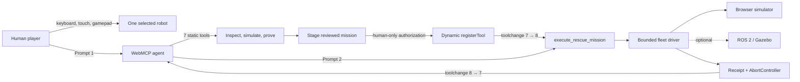

# WebMCP Firebreak

**Play one rescue robot. Let an agent safely coordinate the fleet.**

WebMCP Firebreak is a cinematic, browser-playable warehouse rescue that demonstrates a concrete WebMCP superpower: a website can give an AI agent a new physical-world capability for one reviewed mission, then remove it automatically.

Battery Bay B is burning. Two workers are trapped and a hazardous container is exposed. A person can drive one of four specialist robots with a keyboard, touch controls, or a gamepad. The WebMCP agent can inspect the same emergency, map hazards, plan all four routes, prove eleven safety constraints, and stage a rescue capability. Only a person can authorize it. The one-use `execute_rescue_mission` tool then appears, moves the fleet, returns a receipt, and unregisters itself.

The complete judged demo runs locally in the browser with no account, API key, or backend. An optional ROS 2 adapter shows how the identical bounded driver contract can connect to a controlled Gazebo or robotics lab.

## The problem in one sentence

One person cannot safely drive several emergency robots at once, while giving an AI unrestricted robot control is too dangerous.

Firebreak solves the gap with **compiled mission authority**: the agent may coordinate the fleet only on routes the website has simulated, safety-checked, shown to the operator, and authorized for one use.

## What you do in the demo

1. Click **Start emergency**.
2. Drive the selected robot with `WASD` or the arrow keys. Use `1`–`4` to select a robot and `Space` for its action. Touch controls and standard gamepads also work.
3. Send Prompt 1 by clicking **Ask agent to plan rescue**:

   > Assess WH-01, plan a coordinated rescue, verify safety, and stage the mission tool.

4. Watch the four colored routes appear. Review the exact robots, geofence, lifetime, and 11/11 safety proof.
5. Click **Authorize one mission**. This is a human-only control; no agent tool can press or bypass it.
6. Send Prompt 2 by clicking **Execute approved rescue**:

   > Execute the approved rescue mission now.

7. Watch four specialist robots rescue both workers, isolate and contain the battery fire, and move the exposed load. The final receipt reports two workers safe, the fire contained, the load secured, and zero safety violations.

The WebMCP surface visibly changes from seven tools, to eight after authorization, and back to seven after the one-use mission is consumed.

## Why this needs WebMCP

This is not a chatbot acting out a scripted answer. The page exposes seven real typed capabilities through the top-level imperative WebMCP API. The built-in agent journey invokes those same handlers through either native `document.modelContext` or a browser-local adapter.

Exactly seven static tools register on boot:

| Tool                       | Purpose                                                                       |
| -------------------------- | ----------------------------------------------------------------------------- |
| `inspect_emergency`        | Read WH-01, trapped workers, hazards, objectives, phase, and time limit.      |
| `scan_hazards`             | Use SCOUT-1 thermal sensing to locate workers, fire, load, and collapse zone. |
| `inspect_fleet`            | Read the four role-limited robots, batteries, health, and positions.          |
| `simulate_mission`         | Build deterministic synchronized routes without granting movement authority.  |
| `validate_safety_envelope` | Evaluate eleven gates over the exact routes and current world fingerprint.    |
| `stage_mission_tool`       | Compile a passing plan into a visible proposal; never approve it.             |
| `list_mission_tools`       | Read the staged proposal and current dynamic registration state.              |

After the person approves, the page dynamically registers:

```json
{
  "name": "execute_rescue_mission",
  "input": { "strategy": "coordinated" },
  "additionalProperties": false,
  "oneUse": true,
  "expiresAfterAuthorizationMs": 300000
}
```

An `AbortController` owns the dynamic registration. Completion, cancellation, failure, reset, expiry, or authority loss unregisters it and emits a visible `toolchange`.

## Safety model

The model never invents commands, robot topics, routes, or target coordinates. The website compiles the interface from trusted application state and enforces it again at execution.

The eleven deterministic gates require:

- the current emergency revision and exact world fingerprint;
- exactly four allowlisted robots and complete time-bounded routes;
- no route entering the forbidden collapse polygon;
- at least 1.25 metres of synchronized robot separation;
- at least 20% predicted battery reserve;
- completion within 45 seconds;
- only role-appropriate actions for each robot;
- a clean recovery snapshot; and
- a single coordinated, one-use mission budget.

All tool schemas are closed (`additionalProperties: false`) and revalidated with strict Zod schemas. Execution is rejected if the warehouse changes after simulation. Browser-mode cancellation restores the pre-mission snapshot. ROS mode truthfully stops the fleet and reports partial progress because physical reality cannot be rolled back.

## Architecture



The React interface, Zustand state, Babylon.js warehouse, simulation, policy compiler, browser driver, and WebMCP registry all run locally. Havok powers the scene physics setup. A narrow ROSLIB adapter publishes only code-owned topics and message types.

## Run locally

Prerequisites: Node.js 22 or another current supported Node.js release, plus npm.

```sh
npm install
npm run dev
```

Open the local URL printed by Vite, normally `http://127.0.0.1:5173`.

No API key, environment variable, account, camera, controller, backend, robot, or ROS installation is required. If native WebMCP is unavailable, the page shows **Browser Sim** and runs the same registered definitions and handlers locally.

For a production-like local run:

```sh
npm run build
npm run preview
```

## Test everything

Install Chromium once if Playwright requests it:

```sh
npx playwright install chromium
```

Run the complete release gate:

```sh
npm run check
```

Or run checks individually:

```sh
npm run lint
npm run format:check
npm run typecheck
npm test
npm run build
npm run test:e2e
```

Vitest covers the world seed, route geometry, safety compiler, mission execution, cancellation rollback, keyboard/touch/gamepad normalization, browser and ROS drivers, persistence recovery, strict schemas, adapters, static tools, dynamic registration, `AbortController` lifecycle, and React integration.

Playwright covers the complete native-like two-prompt journey, actual robot movement, seven→eight→seven registration, human-only authorization, one-use execution, receipt recovery, authority loss on reload, reset isolation, keyboard operation, 44×44 targets, serious/critical axe scans, desktop/mobile presentation, horizontal overflow, screenshots, and runtime console/page errors.

Evaluation prompts and expected safety behavior are in [`evals/webmcp-cases.json`](evals/webmcp-cases.json).

## Optional ROS 2 / Gazebo control

[`robotics/README.md`](robotics/README.md) documents the optional ROS 2 Jazzy, Gazebo Harmonic, Nav2, and rosbridge path. The adapter allows only four fixed robot namespaces, fixed `Twist` and `PoseStamped` command topics, telemetry subscriptions, and a fleet emergency-stop topic. It includes a 350 ms velocity watchdog and secure URL rules.

The hosted hackathon demo intentionally uses the deterministic browser driver so judges can run the whole rescue instantly. No claim is made that the app has been certified on physical emergency robots.

## Deploy

Firebreak is a static Vite application:

```sh
npm ci
npm run build
```

Publish `dist/` to any HTTPS static host. Use `npm run build` as the build command and `dist` as the output directory. There are no server functions or runtime secrets.

## Project materials

- [`DEMO_SCRIPT.md`](DEMO_SCRIPT.md) — timed 2:45 live-demo walkthrough.
- [`SUBMISSION_DRAFT.md`](SUBMISSION_DRAFT.md) — ready-to-edit hackathon submission.
- [`STATUS.md`](STATUS.md) — current implementation and verification evidence.
- [`evals/README.md`](evals/README.md) — fixture contract.
- [`docs/superpowers/specs/2026-08-30-webmcp-firebreak-design.md`](docs/superpowers/specs/2026-08-30-webmcp-firebreak-design.md) — product design.
- [`docs/superpowers/plans/2026-08-30-webmcp-firebreak-implementation.md`](docs/superpowers/plans/2026-08-30-webmcp-firebreak-implementation.md) — implementation plan.

## Honest limits

- WH-01 is a fictional but fully interactive emergency, not a live dispatch system.
- Browser mode uses deterministic simulation rather than sensor-derived physics.
- The ROS adapter is tested with a fake bridge; live Gazebo and physical hardware validation are separate integration work.
- Native WebMCP availability depends on the browser while the API evolves.
- Automated accessibility checks are strong regression evidence, not formal certification.

## License

MIT. See [`LICENSE`](LICENSE).
