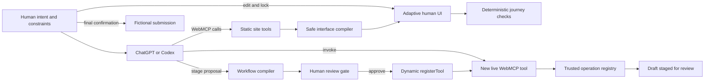

# CivicWeave

**The portal that compiles itself around your goal.**

CivicWeave is a polished, fully client-side WebMCP demonstration inside the fictional Northstar City Services portal. It compiles a task-specific interface, verifies it, lets a person approve a reusable workflow tool, registers that tool live, and still reserves final submission for the person.

## 1. Twenty-second explanation

A resident asks an agent to renew a parking permit using plain language, extra-large controls, and one question at a time. Through seven typed WebMCP tools, the agent reads website-owned capabilities and compiles an accessible view from safe definitions—not generated code. The resident can edit and lock that view. After deterministic checks, the agent stages a reusable workflow; only a human can approve it. CivicWeave then registers `renew_permit_guided` live, the agent invokes it in the same page session, and the workflow stops at a visible review screen for human confirmation.

> Most WebMCP sites give agents a fixed set of tools. CivicWeave lets a person and an agent safely compile a new interface and a new reusable WebMCP tool from the website’s trusted capabilities—then registers that tool live, without generating or executing code.

> One trusted application, many interfaces, and a tool surface that can grow with the user.

## 2. Problem

Municipal portals are organized around departments, menus, forms, and edge cases. People arrive with goals and constraints: “renew my permit,” “explain it plainly,” or “never submit without asking.” They must translate those needs into the portal’s fixed structure, while browser agents inherit the same ambiguity when they depend on labels and clicks.

CivicWeave gives each participant a narrower, more reliable role:

- The person supplies intent, preferences, corrections, locks, and approval.
- The agent interprets intent and composes a bounded workflow.
- The website owns schemas, fields, components, validation, state, and executable operations.

## 3. What makes it new

CivicWeave changes both the visible interface and the live WebMCP tool surface. The generated artifacts are plain, validated data interpreted by components and operations already shipped by the website.

This is not generic AI form filling: the agent does not scrape labels, click an arbitrary website, or improvise values. It discovers typed field IDs and trusted operations exposed by this application.

It is also not a saved notebook workflow: approval persists a declarative workflow definition, but every browser registration is page/session-bound, revalidated on reload, visible in the Tool Surface, and revocable with an `AbortController`. The approved definition becomes an invocable website capability, not a free-form script or recorded macro.

**CivicWeave does not generate executable code. It generates validated interface and workflow definitions interpreted by website-owned components and operations.**

## 4. Canonical two-prompt demo

The application displays both prompts in copyable cards.

**Prompt A**

> Renew my parking permit. I have low vision and want plain language, extra-large controls, one question per screen, and no submission without my approval. Use my current vehicle and email contact. Build the interface, verify it, then propose a reusable tool called `renew_permit_guided`.

Prompt A drives this sequence: inspect the parking capability graph; compile the adaptive view; let the person lock a field; inspect and safely patch around that lock; run deterministic checks; and stage `renew_permit_guided`. Staging opens a human review sheet but does not register the tool.

The person then clicks **Approve & Register**. The Tool Surface adds the compiled tool, the app records a distinct `toolchange` event, and registration is active immediately in that tab.

**Prompt B**

> Use the new `renew_permit_guided` tool for a 12-month permit.

The dynamic tool loads Maya Chen’s fictional current record, selects her current vehicle, preserves her email, sets 12 months, calculates the $60 fictional fee, saves a browser draft, and stages review. Its result is `awaiting_user_confirmation`; it does not submit. Only the visible **Confirm & Submit** button can produce the fictional confirmation.

Parking Permit Renewal also works as a conventional manual flow. Address Change exercises the same generic compiler, validator, operation registry, workflow manager, and human-only submission boundary.

## 5. Why WebMCP is essential

- The person and agent operate on the same live browser state and visible draft.
- Typed capabilities replace scraping and guessed UI labels.
- All seven built-in tools use imperative top-level `document.modelContext.registerTool(...)` registration.
- Human-approved workflows are dynamically registered and unregistered with `AbortController`.
- The app listens for `toolchange` and makes the changing tool surface visible.
- Registration, locking, disabling, deleting, and final submission remain human UI actions.
- Deterministic checks are performed by the website rather than inferred by the model.
- Dynamic execution uses current in-browser context and stops at review.
- The normal portal remains usable when native WebMCP is absent.

Without WebMCP, CivicWeave would only be an adaptive form demo. WebMCP makes the trusted capability graph discoverable, lets the page and agent share state, and makes the live tool-creation loop possible.

## 6. Architecture



The React application and Zustand store run entirely in the browser. Zod validates external inputs. Interface definitions select only known service fields and `FieldKind`-mapped components. Workflow definitions reference only the trusted operation registry. A narrow adapter isolates the evolving browser API: native mode delegates directly to `document.modelContext`, while memory mode executes the same handlers without installing a fake API on `document`.

Approved definitions persist in versioned `localStorage` envelopes. Registrations do not: enabled definitions are revalidated and re-registered for each tab on reload. Invalid persisted data is discarded safely.

## 7. Safety model

The implementation enforces these invariants at domain and WebMCP boundaries:

1. An agent can propose but cannot approve a dynamic tool.
2. A compiled tool can prepare but cannot submit an application.
3. A workflow can reference only prewritten operations from its selected service.
4. A workflow cannot contain `human_only` operations.
5. Generated copy is rendered only as React-escaped text.
6. No generated value is executed as code.
7. Every WebMCP input is revalidated at execution time against a narrow schema with `additionalProperties: false`.
8. Every dynamic definition is revalidated before registration and after reload.
9. Human locks are authoritative; a conflicting patch fails atomically with `LOCKED_BY_USER`.
10. A cancelled or failed workflow restores its complete draft snapshot.
11. Browser capability checks never remove the normal human interface.
12. The application makes no real-world submission or network request.

CivicWeave never generates or executes JavaScript, JSX, HTML, CSS, selectors, URLs, or arbitrary network calls. There is no `eval`, `new Function`, backend, database, authentication, payment, file upload, or government integration.

## 8. Static and dynamic tools

Exactly these seven static tools are registered:

| Tool                  | Annotation       | Purpose                                                                                                 |
| --------------------- | ---------------- | ------------------------------------------------------------------------------------------------------- |
| `inspect_portal`      | Read-only        | Read trusted services, fields, operations, human-only boundaries, and optional current fictional state. |
| `compile_task_view`   | Reversible write | Compile and display a validated interface definition from known fields and safe preferences.            |
| `inspect_task_view`   | Read-only        | Read the active view, locks, compact check state, and current draft values.                             |
| `patch_task_view`     | Reversible write | Atomically patch safe preferences, order, visibility, title, or copy while honoring locks.              |
| `run_journey_checks`  | Read-only        | Run deterministic completeness, safety, presentation, and optional DOM accessibility checks.            |
| `stage_workflow_tool` | Reversible write | Validate and stage a workflow proposal for human review; it cannot approve or register it.              |
| `list_workflow_tools` | Read-only        | List compact metadata for staged, registered, and optionally disabled workflows.                        |

After human approval, the canonical dynamic tool is:

| Tool                  | Origin                  | Input                                                           | Boundary                                                                                                         |
| --------------------- | ----------------------- | --------------------------------------------------------------- | ---------------------------------------------------------------------------------------------------------------- |
| `renew_permit_guided` | Human-approved workflow | `durationMonths`, integer enum `6` or `12`; no extra properties | Runs trusted permit operations sequentially, saves a draft, and stops at review. It cannot call `permit.submit`. |

The compiled tool is not hard-coded as an eighth static tool. Its metadata, input schema, and ordered operation references are derived from the validated proposal and registered live.

## 9. Human approval boundaries

| Action                                       | Agent through WebMCP  | Human through visible UI                   |
| -------------------------------------------- | --------------------- | ------------------------------------------ |
| Inspect services and current task state      | Yes                   | May also view the portal                   |
| Compile or safely patch a task view          | Yes                   | May edit displayed field values            |
| Lock or unlock a field, copy block, or title | No                    | Yes                                        |
| Run deterministic checks                     | Yes                   | May inspect the results                    |
| Stage a reusable workflow proposal           | Yes                   | May review, reject, or return to edit      |
| Approve and register a dynamic tool          | No                    | Yes                                        |
| Disable or delete a compiled tool            | No                    | Yes, with unregistration                   |
| Invoke an approved workflow                  | Yes                   | May inspect its visible operation timeline |
| Submit the staged fictional draft            | No submit tool exists | Yes, after explicit confirmation           |

## 10. Local setup

Prerequisites: a current Node.js release with npm. The verified development environment uses Node.js 22 and npm 10.

```sh
npm install
npm run dev
```

Open the local URL printed by Vite (normally `http://127.0.0.1:5173`). No environment variables, API keys, server, or external account are required. The app starts in Simulator mode when the native browser API is unavailable.

For a production-like local run:

```sh
npm run build
npm run preview
```

## 11. Browser testing

### ChatGPT built-in browser

Open the deployed HTTPS site in a ChatGPT browser environment that exposes imperative WebMCP. When `document.modelContext.registerTool` is available, the header reports **Native WebMCP**. Use the copyable Prompt A and Prompt B cards and keep the top-level page open through approval and invocation so the dynamic registration remains in the same session.

### Chrome WebMCP testing flag

In a Chrome build that offers WebMCP testing support, open `chrome://flags`, search for the WebMCP testing flag, enable it, and relaunch. Flag labels and availability may change while the browser API evolves; confirm that the CivicWeave header reports **Native WebMCP** before testing. The normal portal still works if the flag or API is unavailable.

### Ordinary-browser simulator

Click **How to test** to open the **WebMCP Simulator**. It lists the currently registered tools, annotations, and input schemas; accepts JSON input; and runs the same handlers through the memory adapter. One-click steps cover inspect, low-vision compilation, checks, proposal staging, and—after human approval—12-month invocation. Simulator mode is a local testing fallback, not evidence of native tool discovery.

## 12. Test commands

Install Playwright’s Chromium once if it is not already cached:

```sh
npx playwright install chromium
```

Run checks individually:

```sh
npm run lint
npm run format:check
npm run typecheck
npm test
npm run build
npm run test:e2e
```

Or run the complete required gate in order:

```sh
npm run check
```

Vitest covers compilers, validators, trusted operations, rollback, persistence, adapters, registration lifecycle, and React integration. Playwright installs a native-like top-level `modelContext` before page load and covers the complete 17-step canonical journey, reload/re-registration, disable/reset behavior, keyboard access, axe serious/critical checks, responsive layouts, screenshots, overflow, and runtime console errors. Axe results are deterministic checks of tested screens, not formal WCAG certification.

The fixtures in [`evals/webmcp-cases.json`](evals/webmcp-cases.json) describe tool-selection and schema expectations; they do not claim guaranteed behavior from a particular model.

## 13. Deployment

CivicWeave is a static Vite site. Build it with:

```sh
npm ci
npm run build
```

Publish the generated `dist/` directory to an HTTPS static host such as Vercel, Netlify, Cloudflare Pages, or an equivalent provider. Use `npm run build` as the build command and `dist` as the output directory. There are no server functions or runtime secrets. Preserve the top-level document context; do not embed the canonical app in an iframe.

Native WebMCP availability depends on the browser environment. The application automatically falls back to its in-memory simulator while retaining both manual municipal flows.

## 14. Current limitations

- CivicWeave deeply implements two fictional services; it does not adapt third-party sites.
- Data and approved definitions live only in versioned browser storage on the current device.
- Dynamic WebMCP registrations are tab/session-bound, even when approval metadata is saved.
- WebMCP is evolving, so native discovery and testing controls depend on the browser build.
- The memory simulator proves shared handlers and lifecycle behavior but is not native WebMCP discovery.
- Accessibility checks cover deterministic rules and tested axe screens; they are not a claim of formal certification.
- Modeled interaction counts compare application journeys; they are not a DOM-scraping benchmark.
- The demo has no real identity, payment, upload, notification, or municipal integration.

## 15. Fictional-service disclaimer

**CivicWeave and Northstar City are fictional. This demonstration does not connect to a government service or submit real information.**

Maya Chen, the vehicle, addresses, permit, fees, confirmation numbers, and all city records are fictional test data. USD is displayed only for demonstration clarity. CivicWeave is not affiliated with a government entity and should not be used for real applications.

## 16. Project materials

- [`DEMO_SCRIPT.md`](DEMO_SCRIPT.md): a timed sub-three-minute walkthrough.
- [`SUBMISSION_DRAFT.md`](SUBMISSION_DRAFT.md): ready-to-edit challenge submission prose with link placeholders.
- [`evals/README.md`](evals/README.md): fixture contract and validation guidance.
- [`STATUS.md`](STATUS.md): implementation, verification, and final-audit status.
- [`CivicWeave_Complete_Build_Spec.md`](CivicWeave_Complete_Build_Spec.md): product and engineering source of truth.

## 17. License

Licensed under the MIT License. See [`LICENSE`](LICENSE).
