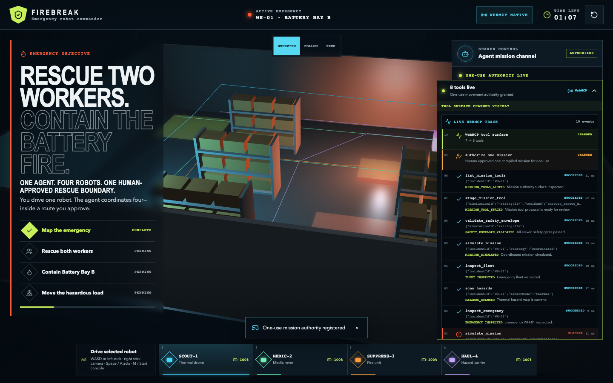
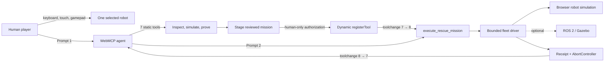

# Firebreak: WebMCP Emergency Robot Commander

**One agent. Four robots. One human-approved rescue boundary.**

Firebreak is a cinematic, browser-playable warehouse rescue that demonstrates a concrete WebMCP superpower: a website can give an AI agent a new simulated robot-control capability for one reviewed mission, then remove it automatically.



## For judges

- **Live demo:** [firebreak-eosin.vercel.app](https://firebreak-eosin.vercel.app/)
- **Real agent path:** open Firebreak in the Codex or ChatGPT built-in browser, confirm **WebMCP Native**, and paste the two prompts shown on the page.
- **What to watch:** a refused out-of-sequence call, seven planning tools, 11/11 gates, one human click, `toolchange` from **7 → 8**, one execution, then **8 → 7**.
- **What is not AI:** an ordinary browser shows **Replay walkthrough · no agent**, a disclosed deterministic fallback for viewing the product.
- **Source:** [github.com/bilgin-kocak/firebreak](https://github.com/bilgin-kocak/firebreak)

Battery Bay B is burning. Two workers are trapped and a hazardous container is exposed. A person can drive one of four specialist robots with a keyboard, touch controls, or a gamepad. The WebMCP agent can inspect the same emergency, map hazards, plan all four routes, prove eleven safety constraints, and stage a rescue capability. Only a person can authorize it. The one-use `execute_rescue_mission` tool then appears, moves the fleet, returns a receipt, and unregisters itself.

The application itself needs no API key or backend. In the Codex or ChatGPT built-in browser, the signed-in agent discovers and invokes the page tools directly. In an ordinary browser, **Replay walkthrough · no agent** exercises the same handlers as a disclosed fallback. An optional ROS 2 adapter shows how the bounded driver contract could connect to a controlled Gazebo or robotics lab after separate hardware validation.

## The problem in one sentence

One person cannot safely drive several emergency robots at once, while giving an AI unrestricted robot control is too dangerous.

Firebreak solves the gap with **compiled mission authority**: the agent may coordinate the fleet only on routes the website has simulated, safety-checked, shown to the operator, and authorized for one use.

## What you do in the demo

1. Click **Start emergency**.
2. Optional: copy the red safety-test prompt. The agent asks to simulate too early; Firebreak refuses with `HAZARD_SCAN_REQUIRED`, and the robots do not move.
3. Drive the selected robot with `WASD` or the arrow keys. Use `1`–`4` to select a robot and `Space` for its action. On a standard gamepad, the left stick drives, the right stick moves the camera, bumpers switch robots, A/Cross acts, and Start/Options opens mission control. Touch has forward, reverse, turn, action, robot selection, and direct camera drag.
4. In the Codex or ChatGPT chat beside the built-in browser, send Prompt 1 shown on the page:

   > Assess WH-01, plan a coordinated rescue, verify safety, and stage the mission tool.

5. Watch the live trace and four colored routes appear. Review the exact robots, geofence, lifetime, and 11/11 safety proof.
6. Click **Authorize one mission**. This is a human-only control; no agent tool can press or bypass it.
7. Return to the chat beside the page and send Prompt 2:

   > Execute the approved rescue mission now.

8. Watch four specialist robots complete the deterministic warehouse scenario. The final simulated receipt reports two workers safe, the fire contained, the load secured, and zero safety violations.

The WebMCP surface visibly changes from seven tools, to eight after authorization, and back to seven after the one-use mission is consumed.

## Why this needs WebMCP

Without WebMCP, an agent would have to scrape UI text, guess state, and request broad control. Firebreak instead exposes typed, validated tools whose sequencing and authority remain owned by the website. In the built-in browser, a real Codex or ChatGPT agent invokes those handlers through native `document.modelContext`. In an ordinary browser there is no model: **Replay walkthrough · no agent** is a disclosed deterministic fallback.

**What can people and agents do together that was impossible before?** A person can define and approve one exact high-stakes boundary while an agent coordinates several actions inside it at machine speed; the website then removes that authority automatically.

The reusable idea is **compiled one-use authority**, not only robot rescue. The same WebMCP pattern can guard a production deploy, large refund, fund transfer, bulk delete, or incident remediation: inspect and simulate freely, prove policy, require one visible human grant, act once, leave a receipt, and self-revoke.

Exactly seven static tools register on boot:

| Tool                       | Purpose                                                                       |
| -------------------------- | ----------------------------------------------------------------------------- |
| `inspect_emergency`        | Read WH-01, trapped workers, hazards, objectives, phase, and time limit.      |
| `scan_hazards`             | Use SCOUT-1 thermal sensing to locate workers, fire, load, and collapse zone. |
| `inspect_fleet`            | Read the four role-limited robots, batteries, health, and positions.          |
| `simulate_mission`         | Build deterministic synchronized routes without granting movement authority.  |
| `validate_safety_envelope` | Evaluate eleven gates over the exact routes and current world fingerprint.    |
| `stage_mission_tool`       | Compile a passing plan into a visible proposal; never approve it.             |
| `list_mission_tools`       | Read the staged proposal and current dynamic registration state.              |

After the person approves, the page dynamically registers:

```json
{
  "name": "execute_rescue_mission",
  "inputSchema": {
    "type": "object",
    "properties": { "strategy": { "type": "string", "enum": ["coordinated"] } },
    "required": ["strategy"],
    "additionalProperties": false
  },
  "annotations": { "readOnlyHint": false, "untrustedContentHint": false }
}
```

The registered WebMCP definition contains the tool name, description, closed input schema, annotations, and execution handler. Firebreak separately enforces the compiled proposal's one-use budget and five-minute post-authorization expiry. An `AbortController` owns the registration; completion, cancellation, failure, reset, expiry, or authority loss unregisters it and emits a visible `toolchange`.

## Safety model

The model never invents commands, robot topics, routes, or target coordinates. The website compiles the interface from trusted application state and enforces it again at execution.

The eleven deterministic gates require:

- the current emergency revision and exact world fingerprint;
- exactly four allowlisted robots and complete time-bounded routes;
- no route entering the forbidden collapse polygon or warehouse shelving;
- at least 1.25 metres of synchronized robot separation;
- at least 20% predicted battery reserve;
- completion within 45 seconds;
- only role-appropriate actions for each robot;
- a clean recovery snapshot; and
- a single coordinated, one-use mission budget.

All tool schemas are closed (`additionalProperties: false`) and revalidated with strict Zod schemas. Execution is rejected if the warehouse changes after simulation. The deterministic 90-second incident clock stops the fleet when time expires. Browser-mode cancellation restores the pre-mission snapshot. ROS mode truthfully stops the fleet and reports partial progress because physical reality cannot be rolled back.

## Architecture



The React interface, Zustand state, Babylon.js warehouse, simulation, policy compiler, browser driver, and WebMCP registry all run locally. Havok powers the scene physics setup. A narrow ROSLIB adapter publishes only code-owned topics and message types.

The native compatibility boundary requires only the standard top-level `document.modelContext.registerTool` method. When optional page-side discovery, manual execution, or `toolchange` helpers are unavailable, Firebreak mirrors those bookkeeping functions locally while the browser agent continues to discover and invoke the real registered site tools.

## Run locally

Prerequisites: Node.js 22 or another current supported Node.js release, plus npm.

```sh
npm install
npm run dev
```

For the tested live-agent path, use the Codex or ChatGPT desktop built-in browser with GPT-5.6 Sol, then open [firebreak-eosin.vercel.app](https://firebreak-eosin.vercel.app/). When site tools are available for the host account, click **Start emergency**, send the two on-screen prompts from the surrounding chat, and the page shows **WebMCP Native** while it waits for real agent tool calls. You can use the local URL printed by Vite—normally `http://127.0.0.1:5173`—for development.

The app requires no OpenAI API key, environment variable, camera, controller, backend, robot, or ROS installation; Codex/ChatGPT uses the account already signed into the host app. If native WebMCP is unavailable, the page shows **Replay walkthrough · no agent**. Its two local buttons exercise the same registered definitions and handlers without claiming a model is involved.

For a production-like local run:

```sh
npm run build
npm run preview
```

## Test everything

Install Chromium once if Playwright requests it:

```sh
npx playwright install chromium
```

Run the complete release gate:

```sh
npm run check
```

Or run checks individually:

```sh
npm run lint
npm run format:check
npm run typecheck
npm test
npm run build
npm run test:e2e
```

Vitest covers the world seed, route geometry, safety compiler, mission execution, cancellation rollback, keyboard/touch/gamepad normalization, browser and ROS drivers, persistence recovery, strict schemas, adapters, static tools, dynamic registration, `AbortController` lifecycle, and React integration.

Playwright covers the complete native-like two-prompt journey by invoking tools through the page's `document.modelContext` boundary—not through in-page agent buttons—plus actual keyboard and mocked-standard-gamepad robot movement, camera and robot switching, seven→eight→seven registration, human-only authorization, one-use execution, receipt recovery, authority loss on reload, reset isolation, keyboard operation, 44×44 targets, serious/critical axe scans, desktop/mobile presentation, horizontal overflow, screenshots, and runtime console/page errors.

Twenty-one authored evaluation prompts and expected safety behaviors are in [`evals/webmcp-cases.json`](evals/webmcp-cases.json). They are fixtures for a live-model harness, not a claimed model pass rate; deterministic handler outcomes are enforced by Vitest and Playwright.

## Optional ROS 2 / Gazebo control

[`robotics/README.md`](robotics/README.md) documents the optional ROS 2 Jazzy, Gazebo Harmonic, Nav2, and rosbridge path. The adapter allows only four fixed robot namespaces, fixed velocity, pose, and role-action topics, fresh odometry/battery checks, positive action-result feedback, and a fleet emergency-stop topic. It includes a 350 ms velocity watchdog and secure URL rules.

The hosted hackathon demo intentionally uses the deterministic browser driver so judges can run the whole rescue instantly. No claim is made that the app has been certified on physical emergency robots.

## Deploy

Firebreak is a static Vite application:

```sh
npm ci
npm run build
```

Publish `dist/` to any HTTPS static host. Use `npm run build` as the build command and `dist` as the output directory. There are no server functions or runtime secrets.

## Project materials

- [`DEMO_SCRIPT.md`](DEMO_SCRIPT.md) — timed live-agent recording walkthrough, including the refusal beat.
- [`SUBMISSION_DRAFT.md`](SUBMISSION_DRAFT.md) — ready-to-edit hackathon submission.
- [`STATUS.md`](STATUS.md) — current implementation and verification evidence.
- [`evals/README.md`](evals/README.md) — fixture contract.
- [`docs/superpowers/specs/2026-08-30-webmcp-firebreak-design.md`](docs/superpowers/specs/2026-08-30-webmcp-firebreak-design.md) — product design.
- [`docs/superpowers/plans/2026-08-30-webmcp-firebreak-implementation.md`](docs/superpowers/plans/2026-08-30-webmcp-firebreak-implementation.md) — implementation plan.

## Honest limits

- WH-01 is a fictional but fully interactive emergency, not a live dispatch system.
- Browser mode uses deterministic simulation rather than sensor-derived physics.
- The ROS adapter is tested with a fake bridge; live Gazebo and physical hardware validation are separate integration work.
- Native WebMCP availability depends on the browser while the API evolves.
- Replay walkthrough is a deterministic local fallback, not an AI agent.
- Automated accessibility checks are strong regression evidence, not formal certification.

## License

MIT. See [`LICENSE`](LICENSE).
