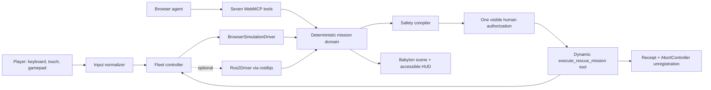

# WebMCP Firebreak Design

**Date:** 2026-08-30  
**Status:** Approved for implementation  
**Product:** WebMCP Firebreak — Emergency Robot Fleet  
**Tagline:** One person drives one robot. An agent coordinates the whole rescue.

## 1. Product decision

WebMCP Firebreak replaces the fictional production-incident dashboard with a playable emergency-robot game. The previous Airlock safety architecture remains useful, but its domain, interface, copy, fixtures, and canonical journey are replaced.

The shipped live application must work without accounts, secrets, a backend, ROS, or special hardware. It runs a complete deterministic warehouse rescue in the browser. An optional ROS 2 adapter maps the same control interface to standard robot topics so the project demonstrates a credible path from browser simulation to Gazebo or physical robots.

Firebreak is not presented as a certified safety system or a controller for unattended real-world emergencies. It is an interactive WebMCP demonstration of bounded fleet delegation.

## 2. Problem and value

During a fast emergency, a person can manually drive one robot at a time but cannot continuously inspect a changing scene, plan safe routes, and coordinate several specialized robots at once. Giving an agent unrestricted robot access is also unsafe.

Firebreak demonstrates a middle path:

1. The person can directly drive any robot with a game controller or keyboard.
2. The agent reads the live game state through typed WebMCP tools.
3. The agent simulates a coordinated mission and compiles a visible safety envelope.
4. The person authorizes that envelope once.
5. The agent autonomously coordinates the fleet inside that envelope.
6. The temporary mission capability disappears when used, cancelled, expired, or revoked.

WebMCP matters because the agent and the player operate on the same live browser state. The page exposes structured capabilities instead of asking the agent to infer a 3D scene through screenshots and simulated clicks.

## 3. Canonical scenario

### 3.1 Warehouse emergency

The scene is a stylized, low-poly distribution warehouse at night. A damaged lithium-battery pallet ignites in Battery Bay B. Smoke spreads across two aisles, two workers need evacuation, and a hazardous container must be moved before the fire reaches it. A marked collapse zone is forbidden.

The fleet contains four visually distinct robots:

| Robot        | Form                  | Mission role                                       |
| ------------ | --------------------- | -------------------------------------------------- |
| `SCOUT-1`    | quadcopter            | map heat, smoke, workers, and route visibility     |
| `MEDIC-2`    | tracked rescue rover  | reach and evacuate Worker A                        |
| `SUPPRESS-3` | heavy fire rover      | isolate power and suppress Battery Bay B           |
| `HAUL-4`     | compact carrier rover | evacuate Worker B and move the hazardous container |

### 3.2 Player controls

The application is a real playable scene, not an animated dashboard.

- Keyboard: `WASD` or arrows drive, `Q/E` rotate, `Space` performs the robot's contextual action, and `1–4` select a robot.
- Standard gamepad: left stick drives, right stick rotates the camera, `A/Cross` performs the action, bumpers change robot, and `Start/Options` opens mission control.
- Touch: an on-screen movement pad, action button, robot selector, and camera-drag gesture.
- Every gamepad action has keyboard and touch equivalents.

Manual mode intentionally exposes the coordination problem: the player can control only the selected robot while fire and mission time continue to advance.

### 3.3 Two-prompt journey

**Prompt A**

> Emergency WH-01: rescue both workers, isolate Battery Bay B, contain the fire, and move the hazardous container. Keep every robot outside the collapse zone, avoid collisions, preserve at least 20% battery, and prepare the safest one-use coordinated mission.

The agent invokes all seven static tools. The page shows scan waves, map annotations, planned paths, predicted completion time, safety gates, and a staged mission envelope. Staging never registers or starts the mission.

The player opens the review panel and clicks **Authorize one mission**. This is the only mandatory human approval. It authorizes the complete plan, not individual movements.

**Prompt B**

> Execute the authorized coordinated rescue mission.

The agent invokes `execute_rescue_mission` with `{ "strategy": "coordinated" }`. All four robots move concurrently. The camera can follow the fleet automatically or remain under player control. The mission rescues both workers, isolates and contains the fire, relocates the container, records a receipt, and unregisters the one-use tool.

## 4. Experience and visual direction

### 4.1 Principle

The warehouse is the product. The 3D scene occupies at least 70% of the desktop viewport and the full background on mobile. Interface panels float over the scene and stay secondary. There is no multi-column operations dashboard.

### 4.2 Art direction

The visual language is a premium near-future rescue game:

- deep navy and charcoal warehouse materials;
- warm sodium work lights and cold cyan robot lamps;
- orange fire, volumetric-looking smoke sprites, sparks, alarms, and emergency strobes;
- thin cyan route projections and red forbidden-zone grids;
- industrial condensed display type paired with a highly readable UI sans;
- restrained glass panels with solid dark fallbacks;
- status is communicated with text, shape, motion, and color together.

The robots use original procedural geometry assembled from Babylon.js primitives. No remote assets or unclear licenses are required. Robot silhouettes, colors, lights, wheel or rotor motion, and role icons make them identifiable at a glance.

### 4.3 Cinematic moments

1. **Ignition:** pressing **Start emergency** dims normal lights, triggers an alarm, ignites Battery Bay B, and starts the mission timer.
2. **Manual realization:** the selected robot responds immediately to keyboard, touch, or gamepad while the rest of the fleet waits.
3. **Agent scan:** scan rings, thermal markers, and robot status pings appear as WebMCP tools run.
4. **Plan reveal:** four route ribbons draw simultaneously and the collapse-zone boundary pulses.
5. **Authorization:** the allowed robots, tasks, zones, duration, and stop conditions appear directly over the scene.
6. **Fleet execution:** the camera cuts between coordinated robots while the HUD completes mission goals.
7. **Resolution:** alarms stop, emergency lights settle, smoke reduces, workers reach the safe zone, and a compact mission receipt appears.

Animations respect `prefers-reduced-motion`; the same state changes remain understandable without camera cuts, flashes, or particles.

## 5. Technology choices

### 5.1 Live application

- React, TypeScript, Vite, Zustand, and Zod remain from the current project.
- Babylon.js renders the 3D warehouse and robots.
- Babylon.js Havok provides browser-side rigid-body collision support for the playable manual-control layer and scene debris.
- The browser Gamepad API provides controller input. A small project-owned normalizer handles dead zones and standard mappings.
- CSS provides the HUD, overlays, dialogs, touch controls, and accessible scene alternative.

### 5.2 Robotics adapter

The domain uses a narrow `RobotDriver` interface. The canonical browser demo uses `BrowserSimulationDriver`. `Ros2Driver` uses `roslibjs` over `rosbridge_suite` WebSockets.

The ROS adapter supports:

- manual velocity commands through namespaced `geometry_msgs/msg/Twist` topics;
- navigation goals through namespaced `geometry_msgs/msg/PoseStamped` topics;
- odometry and battery subscriptions;
- a fleet emergency-stop topic;
- explicit connection, disconnection, command timeout, and stop-all behavior.

The documented reference environment is ROS 2 Jazzy, Gazebo Harmonic, Nav2, and the AWS small warehouse world. ROS mode is opt-in and never silently connects. The browser simulation remains the judged live experience and release gate.

### 5.3 Determinism boundary

Babylon.js is a renderer and manual-play surface, not the source of mission truth. A deterministic domain engine owns robots, hazards, workers, objectives, route progress, timers, authorization, and receipts. The 3D scene renders snapshots from this engine. This keeps WebMCP results, tests, cancellation, and persistence independent from frame rate or GPU differences.

## 6. Architecture



### 6.1 Units

#### Mission domain

Owns seed state, immutable snapshots, hazard evolution, route planning inputs, safety validation, objective transitions, mission progress, failure rollback, and receipts. It has no React, Babylon, WebMCP, or ROS imports.

#### Fleet controller

Translates normalized manual commands and approved mission steps into a selected `RobotDriver`. It enforces one active execution, propagates cancellation, issues stop-all on failure, and reports progress to the domain.

#### Robot drivers

`BrowserSimulationDriver` updates deterministic robot positions along approved routes. `Ros2Driver` publishes only predefined topic types and names derived from trusted robot identifiers. Raw topic names, arbitrary messages, shell commands, URLs, and executable code never come from the agent.

#### WebMCP registry

Registers static tools imperatively at the top-level runtime through `document.modelContext.registerTool`. A memory adapter runs identical definitions in ordinary browsers. The dynamic mission tool is registered only after the visible authorization action, is owned by an `AbortController`, emits visible `toolchange`, and unregisters on completion, cancellation, expiry, revocation, reset, or page teardown.

#### Presentation

The Babylon scene renders the world. React renders the HUD and all semantic controls. An accessible scene summary exposes the same robots, hazards, workers, goals, timer, and mission progress as structured text and live regions.

## 7. WebMCP contract

Exactly seven static tools register at startup:

| Tool                       | Input                                                          | Effect                                                                                   |
| -------------------------- | -------------------------------------------------------------- | ---------------------------------------------------------------------------------------- |
| `inspect_emergency`        | `{ incidentId: "WH-01" }`                                      | returns trusted objectives, timer, environment, and emergency phase                      |
| `scan_hazards`             | `{ incidentId: "WH-01", sensorMode: "thermal" }`               | reveals fire, smoke, collapse zone, workers, and container locations                     |
| `inspect_fleet`            | `{ incidentId: "WH-01" }`                                      | returns robot roles, position, battery, health, and availability                         |
| `simulate_mission`         | `{ incidentId: "WH-01", strategy: "coordinated" }`             | produces four deterministic routes and predicted outcomes without moving robots          |
| `validate_safety_envelope` | `{ simulationId: string }`                                     | evaluates scope, route, collision, battery, geofence, timeout, and rollback gates        |
| `stage_mission_tool`       | `{ simulationId: string, toolName: "execute_rescue_mission" }` | compiles a passing simulation into a reviewable proposal; never authorizes it            |
| `list_mission_tools`       | `{ incidentId: "WH-01" }`                                      | lists staged, registered, completed, expired, disabled, rejected, and cancelled missions |

The approved dynamic tool is:

```json
{
  "name": "execute_rescue_mission",
  "inputSchema": {
    "type": "object",
    "properties": {
      "strategy": { "type": "string", "enum": ["coordinated"] }
    },
    "required": ["strategy"],
    "additionalProperties": false
  }
}
```

All inputs are validated by closed JSON schemas and strict Zod schemas. Tool handlers return compact structured results plus text intended for the agent. They update the visible game state immediately.

## 8. Safety envelope

Authorization is narrow but does not interrupt each robot movement. The proposal fixes:

- incident `WH-01` and its exact revision;
- robots `SCOUT-1`, `MEDIC-2`, `SUPPRESS-3`, and `HAUL-4`;
- operation sequence and route waypoints for each robot;
- allowed areas and the forbidden collapse polygon;
- maximum ground and air speed;
- minimum predicted and actual battery reserve of 20%;
- minimum separation between robots and workers;
- maximum execution duration of 45 seconds;
- exactly one coordinated mission execution;
- stop conditions for stale state, route deviation, collision risk, lost driver connection, cancellation, or safety-gate failure;
- expiry five minutes after authorization.

The agent cannot generate arbitrary low-level operations. It chooses only from trusted strategies and arguments exposed by the page. The deterministic compiler converts that choice into project-owned operations.

On cancellation or failure, all robot movement stops, the pre-run browser snapshot is restored, the incident remains unresolved, and a failed or cancelled receipt records the reason. ROS mode cannot restore physical reality, so it issues stop-all and truthfully reports partial progress instead of claiming atomic rollback.

## 9. State and persistence

The store is separated into:

- `world`: emergency, robots, workers, hazards, objectives, routes, timer;
- `mission`: simulation, checks, proposal, authorization, execution, receipts;
- `ui`: selected robot, camera mode, panels, reduced-effects setting, control mode;
- `runtime`: WebMCP adapter, dynamic registration, active driver, timers, animation handles.

Only versioned, validated domain and UI snapshots persist. Runtime objects, active controller inputs, ROS connections, dynamic registrations, and in-flight execution never persist. Hydration reconciles revisions and discards stale proposals or authority.

## 10. Error handling

- Missing WebGL shows the full semantic scene summary and tool journey with a clear graphics-unavailable notice.
- Babylon or Havok initialization failure falls back to the semantic experience without preventing WebMCP registration.
- Gamepad disconnection stops manual velocity and switches the HUD to keyboard/touch guidance.
- ROS connection loss stops commands, marks ROS mode disconnected, and cannot silently fall back during an active physical run.
- Tool validation errors do not mutate state.
- Stale, expired, already-used, simultaneous, or revoked dynamic invocations fail before motion begins.
- Reset aborts execution, unregisters the dynamic tool, disconnects ROS, clears timers, restores the seed, and emits truthful UI events.
- No expected failure produces an uncaught promise rejection, console error, or blank canvas.

## 11. Accessibility and responsive behavior

- All actions are keyboard accessible and at least 44 by 44 CSS pixels.
- The canvas has a concise accessible name and is accompanied by a structured scene summary.
- Robot selection, objectives, warnings, tool changes, mission progress, and receipts are available to screen readers.
- Dialog focus is trapped and restored.
- Color is never the only status signal.
- Reduced-motion mode disables camera cuts, screen shake, rapid flashes, and nonessential particles.
- Mobile uses the full-screen scene with thumb controls and one bottom sheet; it has no horizontal overflow at 390 by 844.
- Desktop is verified at 1440 by 1000.

## 12. Performance targets

- Initial live app usable within three seconds on a typical current laptop after assets are cached.
- No remote 3D assets, fonts, or textures are required for the canonical experience.
- Desktop target: stable 50–60 frames per second during the canonical mission.
- Mobile target: at least 30 frames per second using reduced particles, shadow quality, and geometry detail.
- The deterministic mission clock does not depend on render frame count.
- Route and tool-result payloads remain bounded.

## 13. Verification

### Unit and integration

- seed validity and deterministic reset;
- manual control normalization, dead zones, robot switching, and stop-on-blur/disconnect;
- hazard scan, route simulation, collision and collapse-zone rejection;
- safety envelope freshness, battery, scope, duration, and one-use gates;
- browser driver progress, cancellation, stop-all, and snapshot rollback;
- ROS topic allowlisting, message shape, disconnect behavior, and no arbitrary topic publication;
- strict tool schemas and the complete seven-tool investigation;
- dynamic registration, visible `toolchange`, expiry, revoke, concurrency, cancellation, consumption, and reset;
- persistence reconciliation;
- React integration of manual play, proposal, authorization, mission execution, and receipt.

### Playwright

- emergency ignition and manual keyboard control visibly move the selected robot;
- mocked standard gamepad input drives and switches robots;
- exactly seven static tools register;
- Prompt A invokes all seven tools and reveals four planned paths;
- one visible human authorization registers `execute_rescue_mission`;
- Prompt B coordinates all four robots and completes every goal;
- dynamic tool count changes seven to eight to seven;
- second invocation is rejected;
- cancellation, expiry, revoke, reset, and reload are safe;
- semantic scene summary matches important visual state;
- keyboard focus, minimum targets, and axe serious/critical scans pass;
- desktop and mobile screenshots show no overflow or blocked controls;
- canonical console errors and page errors are empty;
- production build works under the preview server.

### Manual release checks

- Xbox-compatible and PlayStation-compatible controller smoke tests where hardware is available;
- ROS 2/Gazebo connection smoke test where the optional environment is available;
- desktop and mobile screenshot inspection at original resolution;
- 2:30–3:00 demo rehearsal from fresh storage.

## 14. Deliverables

- complete playable Firebreak application;
- optional tested ROS 2 browser adapter and setup guide;
- exactly seven static WebMCP tools and one authorized dynamic tool;
- unit, integration, Playwright, accessibility, responsive, and console-error coverage;
- updated README, demo script, submission draft, status report, eval fixtures, and MIT license;
- production build and deployment instructions;
- honest limitations and no Airlock product copy in the shipped experience.

## 15. Acceptance criteria

Implementation is complete only when all of the following are true:

1. A first-time visitor understands within ten seconds that this is a playable robot rescue coordinated by a WebMCP agent.
2. Keyboard and touch can manually drive and select robots; the gamepad path is automated with a browser mock and documented for hardware smoke testing.
3. The warehouse emergency, four robots, two workers, battery fire, hazardous container, safe zone, and forbidden collapse zone are visibly represented in 3D and semantically represented in HTML.
4. The canonical two-prompt journey passes from a fresh page.
5. All seven static tools are real typed handlers and all are used in Prompt A.
6. Only the visible authorization action can register `execute_rescue_mission`.
7. One authorization permits autonomous multi-robot execution without repeated confirmations.
8. The mission rescues both workers, contains the fire, moves the container, preserves the safety envelope, and records a receipt.
9. Completion, cancellation, expiry, revoke, reset, or teardown unregisters the dynamic tool through its `AbortController` and produces visible `toolchange` state.
10. The default live demo needs no backend, credentials, ROS, downloads after build, or external network service.
11. The optional ROS adapter cannot publish arbitrary topics or message types supplied by an agent.
12. Lint, format check, strict typecheck, unit and integration tests, production build, Playwright, accessibility checks, responsive screenshots, and console-error assertions pass.
13. There are no TODOs, mock screens, dead controls, stale Airlock copy, or known P0 failures.
